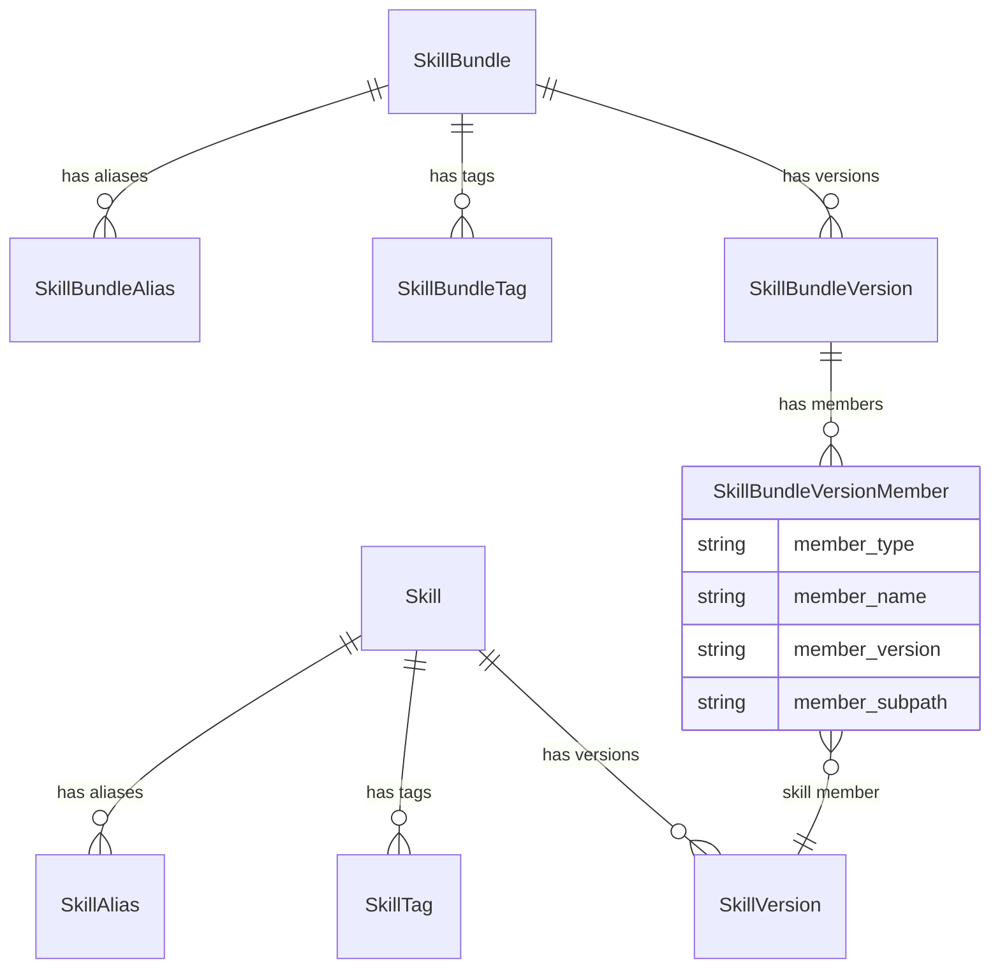
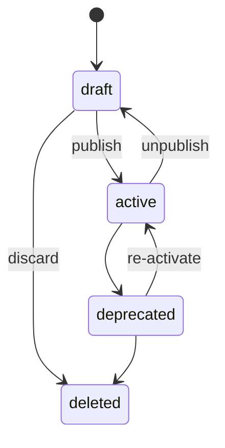

# RFC 0008: Skill Registry

| start_date   | 2026-04-22 |
| :----------- | :--------- |
| mlflow_issue | https://github.com/mlflow/mlflow/issues/22833 |
| rfc_pr       | |

| Author(s)              | [Bill Murdock](https://github.com/jwm4) (Red Hat) |
| :--------------------- | :-- |
| **Date Last Modified** | 2026-07-13 |
| **AI Assistant(s)**    | Claude Code |

**Table of contents**

- [Summary](#summary)
- [Basic example](#basic-example)
- [Motivation](#motivation)
  - [The problem](#the-problem)
  - [User journeys](#user-journeys)
  - [Out of scope](#out-of-scope)
- [Detailed design](#detailed-design)
  - [Entities and data model](#entities-and-data-model)
  - [Status and lifecycle](#status-and-lifecycle)
  - [Pull semantics](#pull-semantics)
  - [Workspace scoping](#workspace-scoping)
  - [Permissions](#permissions)
  - [UI](#ui)
  - [Trace integration](#trace-integration)
  - [Package manager integration](#package-manager-integration)
- [Drawbacks](#drawbacks)
- [Alternatives](#alternatives)
- [Adoption strategy](#adoption-strategy)

# Summary

Add a Skill Registry to MLflow: a governed, metadata-first registry for
AI agent skills. The registry stores metadata and typed source
pointers (to Git repos, OCI registries, ZIP archives, etc.). It can
also store content directly via MLflow artifact storage, but the
primary design is metadata-first. It provides enterprise governance
on top of existing distribution mechanisms: lifecycle management,
usage analytics via traces, and federated discovery across sources.

The registry manages two entity types under the `mlflow.genai.skills`
SDK namespace (CLI: `mlflow skills`), each with full lifecycle
(versioning, aliases, tags, status). Note: MLflow already has an
`mlflow skills` CLI group with `list` and `view` subcommands for
inspecting bundled Assistant skills. The registry subcommands
(`register`, `pull`, `install`, etc.) extend this existing group;
none of the new subcommand names conflict with the existing ones.
See [implementation-details.md: Python SDK and
CLI](implementation-details.md#python-sdk-and-cli) for details.

The two entity types:

- **Skills**: a directory containing a SKILL.md entry point plus
  supporting files (scripts, templates, reference material)
- **Skill bundles**: versioned collections that group related skills
  into a single governed, installable unit

`mlflow skills pull` provides a harness-agnostic way to fetch
registered content from its source. Harness-specific installation
delegates to package managers (APM, Lola, or others via a plugin
interface) that already support cross-harness skill installation.

`mlflow.skill_context()` closes the observability loop by creating
SKILL spans in MLflow traces, annotated with registry coordinates,
enabling adoption tracking, deprecation impact analysis, per-skill
cost attribution, and regression detection.

A follow-up RFC (RFC-0009) will extend skill bundles to include
non-skill members (subagents, hooks, MCP server references).

# Basic example

## Register a skill

```python
import mlflow

mlflow.genai.skills.register_skill(
    name="code-review",
    version="1.0.0",
    description="Reviews pull requests for correctness, style, and security",
    source_type="git",
    source="https://github.com/acme/agent-skills.git@v1.0.0",
    subpath="code-review",
)
```

## Create a skill bundle

```python
from mlflow.genai.skills import SkillMemberRef

mlflow.genai.skills.create_skill_bundle_version(
    name="pr-workflow",
    version="1.0.0",
    skills=[
        SkillMemberRef(name="code-review", version="1.0.0"),
        SkillMemberRef(name="style-check", version="2.0.0"),
    ],
)
```

## Install and use

```bash
# Install a skill bundle for Claude Code via a package manager
mlflow skills install-bundle --name pr-workflow --alias production

# Or install a single skill directly (file download)
mlflow skills install --name code-review --alias production \
    --harness claude-code
```

## Motivation

### The problem

AI agent skills are becoming a critical asset class in enterprise AI
platforms. A cross-harness portable format is emerging around SKILL.md:
a markdown file with structured instructions for the agent, supported
by Claude Code, Codex CLI, Cursor, GitHub Copilot, OpenClaw, Kilo
Code, Antigravity, and others.

Today, skills are managed as ad-hoc files in Git repositories. This
works well for individual developers and small teams. GitHub provides
versioning, collaboration, and access control.

However, enterprises face governance challenges that Git alone does not
address:

1. **No status lifecycle.** Git has no concept of "this version is
   approved for production use" vs. "this is deprecated." Teams resort
   to branch naming conventions or external tracking to manage
   promotion.

2. **Fragmented discovery.** Skills may live in multiple Git repos, OCI
   registries, or other distribution systems. There is no single
   discovery layer across all of these.

3. **No trace-to-skill linkage.** MLflow already traces agent
   conversations (Claude Code via `mlflow autolog claude`, SDK
   applications via framework autologgers such as
   `mlflow.langchain.autolog()` and `mlflow.anthropic.autolog()`).
   These traces capture LLM calls, tool use, and token consumption,
   but there is no way to know which governed, versioned skill was
   active during any part of a trace. This RFC introduces
   `mlflow.skill_context()` for manual instrumentation and an
   install-time trace manifest for automatic instrumentation via
   harness autologgers (see [Trace integration](#trace-integration)).
   Without a registry, organizations cannot answer questions like
   "which skill versions are most used?" or "show me all traces where
   the deprecated code-review v1.0 was loaded."

4. **No cross-source pull mechanism.** Skills may be distributed via
   Git, OCI registries, ZIP archives, or stored directly in MLflow.
   There is no standard way to fetch content from all of these with a
   single command.

### User journeys

These journeys illustrate the end-to-end workflows that the Skill
Registry enables. Each shows both CLI and UI paths.

#### Register a skill bundle

1. Register individual skill versions pointing to their sources:
   ```bash
   mlflow skills register --name code-review --version 1.0.0 \
       --source https://github.com/acme/agent-skills.git@v1.0.0 \
       --subpath code-review
   mlflow skills register --name style-check --version 2.0.0 \
       --source https://github.com/acme/agent-skills.git@v2.0.0 \
       --subpath style-check
   ```
   **SDK equivalent:**
   ```python
   import mlflow

   mlflow.genai.skills.register_skill(
       name="code-review",
       version="1.0.0",
       description="Reviews pull requests for correctness, style, and security",
       source_type="git",
       source="https://github.com/acme/agent-skills.git@v1.0.0",
       subpath="code-review",
   )
   ```
   **UI path:** Navigate to the Skills page, click "Register Skill,"
   fill in name, version, source type, and source URL, then submit.
2. Create a skill bundle version that pins these members:
   ```bash
   mlflow skills create-bundle-version --name pr-workflow --version 1.0.0 \
       --skill code-review:1.0.0 \
       --skill style-check:2.0.0
   ```
   **UI path:** Navigate to the Bundles tab, click "Create Bundle,"
   add members by searching and selecting from registered skills.
3. Transition the bundle version from draft to active:
   ```bash
   mlflow skills update-bundle-version --name pr-workflow \
       --version 1.0.0 --status active
   ```
   **UI path:** Open the bundle version detail page, use the status
   dropdown to change from "draft" to "active."
4. Set an alias for stable downstream resolution:
   ```bash
   mlflow skills set-bundle-alias --name pr-workflow \
       --alias production --version 1.0.0
   ```
   **UI path:** In the bundle detail page, click "Add Alias" and map
   `production` to version `1.0.0`.

#### Discover a skill for a specific purpose

1. Search the registry by keyword:
   ```bash
   mlflow skills search --filter "name LIKE '%review%'" --status active
   ```
   **UI path:** Navigate to the Skills page, type "review" in the
   search bar, and filter by status "active" using the dropdown.
2. Browse the returned list of matching skills with names,
   descriptions, and latest versions.
   **UI path:** Scan the card-based list view. Each card shows the
   skill name, description, latest version badge, status badge, and
   tags.
3. Get details on a promising result:
   ```bash
   mlflow skills get --name code-review
   ```
   **UI path:** Click a card to open the detail view with metadata,
   version history, aliases, tags, and bundle memberships.
4. Inspect a specific version's source and metadata:
   ```bash
   mlflow skills get-version --name code-review --version 1.0.0
   ```
5. Pull the skill locally to read the content and decide whether
   it fits:
   ```bash
   mlflow skills pull --name code-review --version 1.0.0 \
       --destination ./review-skill
   ```

#### Install a skill bundle, run the agent, browse traces

1. Install the bundle using a package manager plugin:
   ```bash
   mlflow skills install-bundle --name pr-workflow --alias production
   ```
   This resolves the bundle from the registry, pulls the bundle
   content, delegates to the configured package manager (e.g., APM
   or Lola) for harness-specific installation, and writes a trace
   manifest (`mlflow-skills-manifest.json`) with installed registry
   coordinates. For direct installation without a package manager:
   ```bash
   mlflow skills install --name code-review --alias production \
       --harness claude-code
   ```
2. Run the agent. The harness loads the installed skills during a
   conversation.
3. Open the MLflow UI and navigate to the Traces page. Click the
   "Skills" tab to filter for traces with SKILL spans.
4. Find the trace for the agent run. Skill invocations appear as
   SKILL spans in the trace tree, annotated with registry coordinates
   (skill name, version, registry).
5. Click a SKILL span to see which registered skill version was used
   and how long it took. Click the skill name link to navigate to the
   skill's registry detail page.

#### Evaluate two bundle versions with LLM judges

MLflow's
[LLM judges](https://mlflow.org/docs/latest/genai/eval-monitor/scorers/)
can autonomously explore execution traces via MCP tools. Because
skill invocations produce traced SKILL spans, LLM judges can
analyze how skills were used during an agent run.

1. Register a new version of the bundle with updated members:
   ```bash
   mlflow skills register --name code-review --version 2.0.0 \
       --source https://github.com/acme/agent-skills.git@v2.0.0 \
       --subpath code-review
   mlflow skills create-bundle-version --name pr-workflow --version 2.0.0 \
       --skill code-review:2.0.0 \
       --skill style-check:2.0.0
   ```
2. Install v1.0.0 and run it on a set of test inputs. Traces are
   recorded in MLflow under experiment A.
3. Install v2.0.0 and run it on the same test inputs. Traces are
   recorded under experiment B.
4. Use `mlflow.genai.evaluate()` with a `make_judge` scorer that
   uses the `{{ trace }}` template variable to score both sets of
   traces against quality criteria (correctness, helpfulness, safety).
5. Compare the evaluation results side by side in the MLflow UI to
   determine whether v2.0.0 is an improvement.
6. If v2.0.0 is better, transition it to active and update the
   production alias:
   ```bash
   mlflow skills update-bundle-version --name pr-workflow \
       --version 2.0.0 --status active
   mlflow skills set-bundle-alias --name pr-workflow \
       --alias production --version 2.0.0
   ```

#### Compare agent performance with and without a skill

A common evaluation scenario is measuring the impact of adding or
removing a skill from an agent's configuration. This uses the same
evaluation infrastructure as version comparison, but one experiment
runs the agent without the skill installed.

1. Run the agent without the skill on a set of test inputs. Traces
   are recorded in MLflow under experiment A (baseline).
2. Install the skill:
   ```bash
   mlflow skills install --name code-review --alias production \
       --harness claude-code
   ```
3. Run the same agent on the same test inputs. Traces are recorded
   under experiment B. Skill invocations appear as SKILL spans in
   the traces.
4. Use `mlflow.genai.evaluate()` with the same scorers on both
   experiments:
   ```python
   baseline_results = mlflow.genai.evaluate(
       data=baseline_traces, scorers=scorers,
   )
   skill_results = mlflow.genai.evaluate(
       data=skill_traces, scorers=scorers,
   )
   ```
5. Compare the evaluation results side by side in the MLflow UI.
   The SKILL spans in experiment B's traces confirm which skill
   version was active during each run, enabling attribution of any
   quality differences.

The same pattern works for comparing different skill sets: install
bundle A for one experiment, bundle B for another, and evaluate
both against the same inputs and scorers.

#### Trace skill lineage to evaluation results

After running evaluations, a user wants to know which registered
skill version was active during a traced agent run. The lineage
path flows through traces: evaluation results link to traces, and
traces contain SKILL spans annotated with registry coordinates.

1. Run an agent with installed skills. Skill invocations produce
   SKILL spans in the recorded traces (see
   [Trace integration](#trace-integration)).
2. Run evaluation against the collected traces:
   ```python
   results = mlflow.genai.evaluate(
       data=traces_df,
       scorers=[correctness_scorer, helpfulness_scorer],
   )
   ```
   Each row in `results.result_df` includes a `trace_id` linking
   the evaluation result back to its source trace.
3. Find which skill versions were used in a specific evaluation
   result:
   ```python
   trace = mlflow.get_trace(trace_id)
   skill_spans = trace.search_spans(span_type="SKILL")
   for span in skill_spans:
       print(span.attributes["mlflow.skill.name"],
             span.attributes["mlflow.skill.version"])
   ```
4. Find all traces that used a specific skill version:
   ```python
   traces = mlflow.search_traces(
       experiment_ids=[experiment_id],
       filter_string=(
           'span.type = "SKILL"'
           ' AND span.attributes.mlflow.skill.name = "code-review"'
           ' AND span.attributes.mlflow.skill.version = "1.0.0"'
       ),
   )
   ```
   Evaluation results for these traces can then be retrieved via
   their `trace_id` values.

This two-step approach (query traces by skill attributes, then
retrieve associated evaluation results) works with the existing
MLflow tracing and evaluation APIs. Richer integration, such as
filtering evaluation results directly by skill version, is
follow-up work (see [Adoption strategy](#adoption-strategy)).

#### CI pipeline for automated regression detection

1. A CI job (e.g., GitHub Actions) triggers on pushes to the skill
   source repo.
2. The job registers a new skill version from the updated source:
   ```bash
   mlflow skills register --name code-review --version 1.1.0 \
       --source https://github.com/acme/agent-skills.git@v1.1.0 \
       --subpath code-review
   mlflow skills create-bundle-version --name pr-workflow --version 1.1.0 \
       --skill code-review:1.1.0 \
       --skill style-check:2.0.0
   ```
3. The job installs the new bundle version and runs it against a
   benchmark dataset, collecting traces in a dedicated MLflow
   experiment.
4. The job runs
   [LLM judge](https://mlflow.org/docs/latest/genai/eval-monitor/scorers/)
   evaluation on the collected traces, producing scored results.
5. The job fetches the benchmark results from the previous production
   version (stored as MLflow metrics or evaluation artifacts).
6. The job compares the new scores against the previous scores. If
   any quality metric regresses beyond a configured threshold, it
   sends an alert (Slack, email, or fails the CI check).
7. If no regression is detected, the job transitions the new version
   to active and optionally updates the production alias.

See [implementation-details.md: SDK and CLI code
examples](implementation-details.md#sdk-and-cli-code-examples) for
additional SDK examples including OCI subpath registration and
discovery/search operations.

### Out of scope

- **Non-skill entity types.** Subagent definitions, hooks, and MCP
  server references are deferred to a follow-up RFC (RFC-0009) that
  will extend skill bundles with non-skill members. The registry
  backend is designed to be extensible to these types.
- **Artifact storage as the only path.** The registry supports both
  external source pointers (Git, OCI, ZIP) and direct artifact storage
  (`source_type="mlflow"`). However, it is not an artifact-only store;
  the metadata-first, source-pointer model remains the primary design.
- **Authoring or development tools.** The registry manages published
  skills, not the process of writing them.
- **Format specification.** The registry is format-agnostic. It does
  not define what a skill must contain or how it must be structured.
  The SKILL.md convention is an ecosystem convention, not a registry
  requirement.
- **Agent routing or orchestration.** The registry is a metadata and
  governance layer. It does not decide which skills to invoke at
  runtime or how agents compose capabilities.
- **MCP server hosting.** MCP server deployment and runtime management
  are covered by the MCP Server Registry (RFC-0004) and the MCP
  Gateway.
- **Prompts.** MLflow already has a Prompt Registry for versioned
  prompt template management. Skills and prompts serve different
  purposes: a skill is a directory containing a SKILL.md entry point
  plus supporting files, with metadata controlling invocation. A
  prompt provides templated text for structured generation. Skills may
  reference prompts, but they belong in separate registries because
  they have different lifecycles and different audiences (harness-based
  agents vs. custom agentic code).
- **Custom harness adapters.** This RFC does not build per-harness
  installation adapters. Instead, it delegates harness-specific
  installation to existing package managers (APM, Lola) via a plugin
  interface.

## Detailed design

### Entities and data model



#### Skill

A skill is a directory containing a SKILL.md entry point plus
supporting files (scripts, templates, reference material). The
`Skill` entity is the logical governed asset, scoped to a workspace.
Key fields include `name` (unique within workspace), `display_name`,
`status` (read-only, derived from the parent-resolved version),
`latest_version` (read-only, highest active semver), and `aliases`.

#### SkillVersion

A versioned record containing a typed source pointer (`git`, `oci`,
`zip`, or `mlflow`), status, and tags. The `(name, version)` pair is
unique within a workspace. Source pointers and version strings are
immutable after creation; to point to different content, register a
new version. The optional `subpath` field identifies content within a
shared artifact (used with Git, OCI, and ZIP). The optional
`content_digest` field enables integrity verification.

#### SkillBundle

A skill bundle groups related skills into a governed unit that maps
to the "plugin" concept in agent harnesses: a curated set of
capabilities that work together. Bundles are a first-class entity
rather than a tag-based grouping because they provide versioned
membership snapshots (reproducible point-in-time combinations),
bundle-level source pointers (a single OCI image or Git repo),
independent lifecycle (deprecate a bundle without deprecating its
members), and direct mapping to the harness plugin concept. Follows
the same top-level pattern as Skill: versions, tags, aliases, and
derived status.

A follow-up RFC (RFC-0009) will extend skill bundles to include
non-skill members (subagent definitions, hooks, and MCP server
references from RFC-0004), enabling full "plugin"-style bundles.
The member table schema includes a `member_type` field for forward
compatibility with this extension.

#### SkillBundleVersion

A versioned snapshot of a bundle's membership. A bundle version is
one of two kinds:

- **Assembled:** captures member references for individual skills.
  Each skill version has its own source. `pull` fetches members
  individually.
- **Monolithic:** has its own source pointer (e.g., a single OCI
  image or Git repo containing multiple skills) and member
  references. Skill member versions may omit their own sources when
  their content lives inside the bundle artifact; the optional
  `member_subpath` on each membership identifies where the member
  lives inside the bundle artifact. `pull` fetches the bundle
  artifact as a unit.

A bundle version cannot have both a bundle-level source and skill
member versions with their own sources. This avoids confusion about
which source is authoritative for skill content.

#### Aliases and tags

All entity types use the same alias pattern: a frozen `(name, alias,
version)` tuple mapping a stable name (e.g., `production`) to a
specific version string. Tags are `(key, value)` pairs at both the
entity level and version level.

Dataclass definitions, field tables, source type details, and
database schema for all entity types are in
[implementation-details.md](implementation-details.md).

### Status and lifecycle

This lifecycle aligns with the MCP Server Registry (RFC-0004).

#### Per-version status

Each `SkillVersion` and `SkillBundleVersion` has an independent
status:



| State | Meaning | Downstream surfacing |
|---|---|---|
| `draft` | Registered but not yet ready for downstream use | Not surfaced to consumers |
| `active` | Ready for downstream use | Surfaced to discovery, traces, consumers |
| `deprecated` | Still functional but no longer recommended | Surfaced with deprecation signal |
| `deleted` | Soft-deleted; preserved internally for history, no longer active | Not surfaced by normal get/search/list APIs |

New versions default to `draft` upon creation.

Allowed transitions:

| From | To |
|---|---|
| `draft` | `active`, `deleted` |
| `active` | `draft`, `deprecated` |
| `deprecated` | `active`, `deleted` |

`draft` allows a version to be registered and reviewed before being
made visible to consumers. `active` can return to `draft` (unpublish)
for cases where a version needs to be pulled back for further review.
`deprecated` can return to `active` (re-activate) for cases where a
deprecation was premature. `deleted` is terminal.

Normal version delete operations (`delete_skill_version` and
`delete_skill_bundle_version`) transition the version to `deleted`
rather than physically removing the version row. Active versions must
first be unpublished or deprecated before they can be deleted.
Deleting a version also removes aliases that point to that version.

Top-level entity delete operations (`delete_skill` and
`delete_skill_bundle`) are administrative hard deletes that remove the
parent and cascade to child rows, following the Model Registry
registered-model pattern. These operations are subject to
referential-integrity checks: a skill version referenced by a bundle
version cannot be physically removed until the referencing bundle
version is removed or otherwise no longer references it. Normal
retirement should use version deprecation or version soft delete
rather than top-level hard delete.

#### Entity-level status

`Skill.status` and `SkillBundle.status` are read-only. They are
derived from the parent-resolved version: the highest semantic version
among `active` versions if one exists, otherwise the highest semantic
version among non-`deleted` non-`active` versions. Deleted versions
never drive parent status. This follows the MCP Server Registry
pattern (RFC-0004).

#### `latest_version` resolution

Version strings must follow [semantic versioning](https://semver.org/)
(e.g., `1.0.0`, `2.1.0-beta.1`). `get_latest_skill_version(name)`
returns the highest semantic version among `active` versions if one
exists, otherwise the highest semantic version among non-`deleted`
non-`active` versions. Prerelease identifiers participate in
semantic-version ordering, while build metadata does not.
`latest_version` is a read-only computed field on the parent entity
(not manually pinnable); aliases cover the use case of pointing a
stable name (e.g., `production`) at a specific version.

The alias name `latest` is reserved: `set_skill_alias(...,
alias="latest", ...)` is rejected, while
`get_skill_version_by_alias(..., alias="latest")` is treated as a
convenience alias for `get_latest_skill_version(...)`.

This aligns with the MCP Server Registry (RFC-0004).

### Pull semantics

`pull` is a client-side operation. The SDK reads the source pointer
from the registry via the REST API, then fetches content directly
from the source system to the caller's local filesystem. The registry
server is not involved in content transfer. `pull` is
source-type-aware:

| Source type | Pull behavior |
|---|---|
| `git` | `git clone` or `git archive` of the referenced path/ref |
| `oci` | `oci pull` of the referenced image/tag; if `subpath` is set, extract only that path from the image |
| `zip` | HTTP download and extract; if `subpath` is set, extract only that path from the archive |
| `mlflow` | Download the version's MLflow-managed artifact directory tree using the same artifact APIs and credentials as other MLflow artifact operations |

**Single skill pull.** Fetches the content at the skill version's
`source` to the destination directory. If `subpath` is set, only the
content at that path within the artifact is extracted. Returns an
error if the skill version has no source; source-less embedded skill
versions are pullable only through their containing monolithic
bundle.

**Skill bundle pull.** For monolithic bundles, fetch the bundle
artifact as a single unit to the destination directory. For assembled
bundles, pull each member individually from its own `source` to a
subdirectory of the destination, named by the member's name. If a
skill member in an assembled bundle has no `source`, the pull fails
rather than producing a partial local bundle.

If `content_digest` is set, `pull` verifies the fetched content
matches the digest and returns an error on mismatch. This
verification is client-side. The server stores the digest as metadata
but does not re-verify artifact store contents on each request.

`pull` is harness-agnostic. It downloads content but does not generate
harness-specific manifests or place files in harness-specific
directories. Harness-specific installation is handled by package
manager plugins (see [Package manager
integration](#package-manager-integration)).

See [implementation-details.md: Pull semantics
details](implementation-details.md#pull-semantics-details) for source
authentication mechanisms, error handling, and credential management.

### Workspace scoping

All skill registry operations are workspace-scoped, following MLflow's
existing workspace-aware registry patterns (model registry, MCP
registry). Cross-workspace sharing is out of scope for this RFC and
should be solved at the platform level across all MLflow registries.

### Permissions

The skill registry integrates with MLflow's existing permission
framework (READ / EDIT / MANAGE), applied at the `Skill` and
`SkillBundle` level. Versions, tags, aliases, and memberships inherit
permissions from their parent entity.

| Permission | Operations |
|---|---|
| `READ` | Search entities, get versions, resolve aliases, list tags and memberships |
| `EDIT` | Create entities, create versions, set tags, update description, status transitions (activate, deprecate), set aliases. Mapped to `can_update` in MLflow's permission framework. |
| `MANAGE` | Delete aliases, delete tags, soft-delete versions, hard-delete entities, manage permissions. Mapped to `can_delete` in MLflow's permission framework. |

This follows the same pattern as the model registry and MCP Server
Registry (RFC-0004).
- **Creator gets MANAGE.** When a user creates an entity (skill or
  bundle), they automatically receive MANAGE permission, following
  the MLflow model registry pattern.

### UI

The Skills page lives under the GenAI workflow in the MLflow sidebar,
alongside Experiments, Prompts, MCP Servers, and AI Gateway.

#### List view

The list view shows skills and bundles together using a card-based
layout consistent with the MCP Server Registry (RFC-0004). Each card
displays:

- Entity type badge (skill or bundle)
- Name and optional display name
- Description (truncated to 2-3 lines)
- Latest version badge (e.g., "v1.0.0")
- Status badge with color coding: draft (gray), active (green),
  deprecated (amber)
- Source type indicator (Git, OCI, ZIP, MLflow)
- Tag chips

The filter bar provides:

- **Type dropdown**: skill, bundle
- **Status dropdown**: draft, active, deprecated
- **Source type dropdown**: git, oci, zip, mlflow
- **Search**: by name or description

A "Register Skill" button (with a dropdown for bundle) initiates
registration.

#### Detail view: skills

The detail view for an individual skill shows:

- **Metadata section**: name, display name, description, status,
  workspace, source type, created by, created at, last updated
- **Version table**: Version, Registered at, Status, Source type,
  Created by, Description. Clicking a version row navigates to the
  version detail page showing source, subpath, content digest, and
  tags.
- **Aliases**: alias name to version mapping (e.g.,
  `production -> 1.0.0`)
- **Tags**: key-value list with edit controls
- **Bundle memberships**: list of bundles that include this skill,
  with links to each bundle's detail page
- **Related traces**: link to the GenAI Traces page filtered by this
  skill's name, showing recent SKILL spans that reference this skill

#### Detail view: bundles

The bundle detail view shows:

- **Metadata section** (as above)
- **Members table** for the selected bundle version: Name, Pinned
  version, Source type, Status. Each row links to the member skill's
  detail page.
- **Version history table**: Version, Registered at, Status, Created
  by, Member count
- **Aliases and tags** (as above)

#### Trace integration display

The GenAI Traces page includes a "Skills" tab alongside the existing
"Prompts" tab, showing SKILL spans for each trace. The trace detail
view displays SKILL spans with registry coordinates (skill name,
version, workspace) and links to the skill's registry detail page.
Skill version detail pages surface related traces using the same
association data.

### Trace integration

MLflow already traces agent conversations across multiple frameworks:
Claude Code (via `mlflow autolog claude`), SDK applications (via
framework autologgers such as `mlflow.langchain.autolog()` and
`mlflow.anthropic.autolog()`), and others. These traces capture LLM
calls, tool use, and timing as a tree of spans. The skill registry
closes the observability loop by letting agent developers indicate
which registered skill is active during each part of a trace.

#### `mlflow.skill_context()` context manager

The primary instrumentation API is a context manager that creates a
span of type `SKILL` and attaches registry coordinates as span
attributes:

```python
with mlflow.skill_context(
    name="code-review", version="1.0.0"
) as span:
    # All spans created inside this block (including those from
    # autologgers) become children of this SKILL span.
    result = llm.chat([{"role": "user", "content": "Review this code..."}])
```

The context manager creates a span with `mlflow.skill.name`,
`mlflow.skill.version`, and `mlflow.skill.workspace`
attributes that link the span back to a specific skill version in
the registry. See [implementation-details.md: skill_context() span
attributes](implementation-details.md#skill_context-span-attributes)
for the full attribute table.

#### Skill stacks via nesting

Skills can invoke other skills. Nesting `skill_context()` calls
produces a skill stack in the trace tree:

```
+-- Span: "code-review" (type: SKILL, version: 1.0.0)
|   +-- Span: ChatCompletion (type: LLM)
|   +-- Span: "style-check" (type: SKILL, version: 2.0.0)
|   |   +-- Span: ChatCompletion (type: LLM)
|   +-- Span: ChatCompletion (type: LLM)
```

Walking up the ancestor chain and collecting SKILL spans reconstructs
the skill stack for any span.

#### Autologger compatibility

Because `skill_context()` creates a standard MLflow span, it works
with existing autologgers without modification. When an autologger
(Claude, LangChain, OpenAI, etc.) creates a span inside a
`skill_context()` block, that span automatically becomes a child of
the SKILL span. No changes to the autologgers are needed.

#### Registry validation

`skill_context()` does not validate that the named skill exists in
the registry at call time. Validating on every invocation would add
latency and create a hard dependency on registry availability. The
trace records the `{workspace, name, version}` coordinates
regardless; the MLflow UI performs a best-effort lookup when
displaying traces and shows a "not found in registry" indicator if
the coordinates do not resolve.

#### Workspace resolution

When `skill_context()` is called, the workspace is resolved from
the `mlflow-skills-manifest.json` written by the install commands.
The manifest contains the workspace for each installed skill.
For SDK users calling `skill_context()` directly without a manifest,
the workspace defaults to the current MLflow tracking URI's workspace
context, consistent with other MLflow operations.

#### Relationship to MCP trace linking

The MCP Registry (RFC-0004) uses after-the-fact, trace-level
association (`link_mcp_server_versions_to_trace()`). Skills use
span-level, inline annotation because skills are ambient (active
during inference) and can nest. Both approaches produce trace
metadata that the MLflow UI can display together.

### Package manager integration

Rather than building custom harness adapters for each agent harness,
the skill registry delegates harness-specific installation to existing
package managers that already support cross-harness skill
installation. This avoids duplicating work that projects like
[APM](https://github.com/microsoft/apm) and
[Lola](https://github.com/LobsterTrap/lola) already handle well, and
lets the MLflow community benefit from their evolving harness support.

#### Two installation paths

The registry supports two installation paths:

1. **Direct install** (`mlflow skills install`): a simple file
   download that places skill content in a harness-specific directory.
   This handles the common case of installing a single skill from any
   supported source type. The `--harness` flag determines the target
   directory (e.g., `.claude/skills/` for Claude Code,
   `.cursor/skills/` for Cursor).

2. **Package manager install** (`mlflow skills install-bundle`): for
   bundles or when full harness-specific manifest generation is
   needed. MLflow resolves registry metadata, pulls content from
   MLflow-specific sources (artifact store, OCI) to local paths, and
   delegates to a configured package manager plugin for
   harness-specific installation.

#### Package manager plugin interface

Package manager plugins are registered via Python entrypoints (group
`mlflow.skill_package_managers`), so third-party plugins can be
installed via `pip install` without modifying MLflow core.

```python
class PackageManagerPlugin:
    def install_skill(
        self,
        name: str,
        local_path: str,
        harness: str | None = None,
        scope: str = "project",
    ) -> str:
        """Install a single skill from a local path.
        Returns the installed path."""
        ...

    def install_bundle(
        self,
        bundle_name: str,
        member_paths: dict[str, str],
        harness: str | None = None,
        scope: str = "project",
    ) -> str:
        """Install a bundle of skills from local paths.
        member_paths maps skill names to local paths.
        Returns the installed path."""
        ...

    def supported_harnesses(self) -> list[str]:
        """Return list of harness identifiers this plugin supports."""
        ...
```

#### Source resolution flow

When `mlflow skills install-bundle` is invoked:

1. MLflow resolves the bundle version from the registry (by name +
   version or alias).
2. For each member skill, MLflow pulls content to a local temporary
   directory using the same source-type-aware logic as
   `mlflow skills pull`.
3. MLflow passes the local paths to the configured package manager
   plugin, which handles harness-specific directory placement and
   manifest generation.
4. MLflow writes the `mlflow-skills-manifest.json` trace manifest
   with installed registry coordinates.

For Git-backed skills, the package manager can also fetch directly
from Git (APM and Lola both support Git sources natively). In this
case, MLflow can provide the Git coordinates from the registry
metadata and let the package manager handle the fetch, avoiding a
redundant local pull.

#### Trace manifest

Both installation paths write an `mlflow-skills-manifest.json` file
that records installed registry coordinates. This manifest enables
automatic SKILL span creation by harness autologgers:

```json
{
  "manifest_version": "1.0",
  "skills": {
    "code-review": {
      "name": "code-review",
      "version": "1.0.0",
      "workspace": "default"
    },
    "style-check": {
      "name": "style-check",
      "version": "2.0.0",
      "workspace": "default"
    }
  }
}
```

### Implementation details

Database schema (table definitions), store interface (method
signatures), entity dataclass definitions, REST API endpoints,
pagination/filtering, SDK convenience functions, and CLI mapping are
in [implementation-details.md](implementation-details.md).

## Drawbacks

- **Source pointer validity.** For external sources (git, oci, zip),
  the registry cannot guarantee pointers remain valid. The optional
  `content_digest` field mitigates content tampering but does not
  prevent link rot. Users who need self-contained storage can use
  `source_type="mlflow"` to store content directly in MLflow artifact
  storage.

- **Package manager dependency.** Full harness-specific installation
  requires a package manager plugin (APM, Lola, or similar). Users
  who do not install a package manager can still use direct install
  (`mlflow skills install`) for single skills, and `mlflow skills
  pull` for harness-agnostic content download.

# Alternatives

## Store skill artifacts only in MLflow (no source pointers)

Make MLflow artifact storage the sole storage mechanism, with no
support for external source pointers.

Rejected because most organizations already manage skills in Git or
OCI. Source pointers federate across existing distribution mechanisms
without requiring migration. The current design supports both:
`source_type="mlflow"` for direct artifact storage alongside
`source_type="git"`, `"oci"`, and `"zip"` for external sources.

## Use Git alone (no registry)

Continue using Git repositories as the sole mechanism for skill
management.

This is sufficient for individual developers and small teams. This RFC
proposes a governance layer on top of Git for enterprises that need
status lifecycle, trace-to-skill linkage, and federated discovery.
The two approaches are complementary.

## Build custom harness adapters in MLflow

Build per-harness installation adapters within MLflow (as proposed in
the earlier version of this RFC).

Rejected in favor of delegating to existing package managers. APM and
Lola already support 8+ and 6+ harnesses respectively, and their
harness support evolves independently of MLflow releases. Building
custom adapters would duplicate this work and create an ongoing
maintenance burden as harness plugin formats evolve. The plugin
interface allows MLflow to integrate with any package manager without
coupling to a specific one.

## Use APM or Lola directly without a registry

Use a client-side package manager (APM, Lola, or `gh skill install`)
as the sole mechanism for skill management.

These tools solve the client-side "make it portable and reproducible"
problem well. However, they are not server-side registries and do not
provide the governance and observability features that enterprises
need:

- **Lifecycle management.** No concept of draft, active, deprecated,
  or deleted status. No way to signal consumers that a skill version
  is deprecated or approved for production.
- **Rich discovery.** Limited search and metadata capabilities. No
  centralized catalog with tags, descriptions, and compatibility
  information.
- **Trace integration.** No connection between installed skills and
  runtime execution traces. No way to answer "which skill version
  was active during this agent run?"
- **RBAC and workspace scoping.** No per-user or per-team access
  controls. No visibility boundaries between teams or projects.

The skill registry and package managers are complementary: the
registry provides the server-side governance, discovery, and
observability layer, while package managers handle client-side
installation and harness-specific adaptation.

# Adoption strategy

New feature, not a breaking change. Phased rollout:

- **Phase 1 (this RFC):** Skill and SkillBundle entities, store,
  REST API, SDK, CLI, UI, `mlflow skills pull`,
  `mlflow skills install` (direct), package manager plugin interface,
  and `mlflow.skill_context()` for trace integration.
- **Phase 2 (RFC-0009):** Extend skill bundles with non-skill
  members: subagent definitions, hooks, and MCP server references
  (cross-registry with RFC-0004).
- **Phase 3 (follow-up):** Usage analytics dashboards, install count
  tracking, cross-workspace export/import (following cross-registry
  patterns), shared base extraction with the MCP registry, and richer
  evaluation-to-skill query integration (e.g., filtering evaluation
  results directly by skill version attributes).
