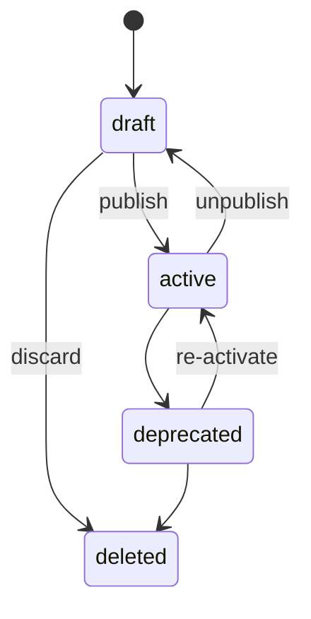

# RFC 0008: Skill Registry

| start_date   | 2026-04-22 |
| :----------- | :--------- |
| mlflow_issue | https://github.com/mlflow/mlflow/issues/22833 |
| rfc_pr       | https://github.com/mlflow/rfcs/pull/26 |

| Author(s)              | [Bill Murdock](https://github.com/jwm4) (Red Hat) |
| :--------------------- | :-- |
| **Date Last Modified** | 2026-07-16 |
| **AI Assistant(s)**    | Claude Code, Codex |

**Table of contents**

- [Summary](#summary)
- [Basic example](#basic-example)
- [Motivation](#motivation)
  - [The problem](#the-problem)
  - [User journeys](#user-journeys)
  - [Out of scope](#out-of-scope)
- [Detailed design](#detailed-design)
  - [Entities and data model](#entities-and-data-model)
  - [Status and lifecycle](#status-and-lifecycle)
  - [Plugin import](#plugin-import)
  - [Pull semantics](#pull-semantics)
  - [Workspace scoping](#workspace-scoping)
  - [Permissions](#permissions)
  - [UI](#ui)
- [Drawbacks](#drawbacks)
- [Alternatives](#alternatives)
- [Adoption strategy](#adoption-strategy)

# Summary

Add a Skill Registry to MLflow: a governed, metadata-first registry for
AI agent skills. The registry stores metadata and typed source
pointers (to Git repos, OCI registries, ZIP archives, etc.). It can
also store content directly via MLflow artifact storage, but the
primary design is metadata-first. It provides enterprise governance
on top of existing distribution mechanisms: lifecycle management
and federated discovery across sources.

The registry manages two entity types under the `mlflow.genai` SDK
namespace (CLI: `mlflow skills`), following the top-level
public SDK pattern established by the MCP Server Registry (RFC-0004).
Each has full lifecycle (versioning, aliases, tags, status). MLflow already has an `mlflow skills` CLI group with `list` and `view`
subcommands that inspect bundled Assistant skills; the registry's
subcommands use different names, so there is no direct conflict.
See [implementation-details.md: Python SDK
and CLI](implementation-details.md#python-sdk-and-cli) for details.
The two entity types are:

- **Skills**: a directory containing a SKILL.md entry point plus
  supporting files (scripts, templates, reference material). See the
  [Agent Skills specification](https://agentskills.io/) for the
  complete format definition.
- **Skill bundles**: versioned collections that group related skills
  into a single governed distribution unit

**Minimize required inputs.** The CLI and API infer optional fields
from source content when possible, so the simplest invocation requires
only what cannot be derived. For example, `source_type` is inferred
from the source URL, and `name` can be extracted from the skill's
SKILL.md entry point. Inference happens server-side to keep SDKs thin
and portable across languages.

`mlflow skills pull` provides a harness-agnostic way to fetch
registered content from its source.
Existing Claude Code plugins can be imported as monolithic bundles:
MLflow registers their discovered skills, preserves the plugin source,
and warns about non-skill content that is pulled alongside
the skills but does not receive individual registry entries.

[RFC-0009: Extended Skill Bundles](https://github.com/mlflow/rfcs/pull/27)
will add registry entries for non-skill bundle members (e.g., subagents,
MCP server references).

# Basic example

## Register a skill

```python
import mlflow

# Minimal: name inferred from SKILL.md content, source_type from URL
mlflow.genai.register_skill(
    source="https://github.com/acme/agent-skills.git@v1.0.0",
    subpath="code-review",
)

# With explicit subpath
mlflow.genai.register_skill(
    name="code-review",
    source="https://github.com/acme/agent-skills.git@v1.0.0",
    subpath="code-review",
)
```

## Create a skill bundle

```python
mlflow.genai.create_skill_bundle_version(
    name="pr-workflow",
    skills=[
        "skills:/code-review/1",
        "skills:/style-check/1",
    ],
)
```

## Import an existing plugin

```bash
mlflow skills bundles import \
    --source https://github.com/acme/plugins.git@v1.0.0 \
    --subpath pr-workflow \
    --skill-uri skills:/pr-workflow
```

MLflow discovers skill directories (subdirectories containing a
SKILL.md entry point) and registers them as members of a monolithic
bundle. It preserves the Git source on the bundle and warns about
non-skill content that is not registered as individual entities.

## Motivation

### The problem

AI agent skills are becoming a critical asset class in enterprise AI
platforms. A cross-harness portable format is emerging around SKILL.md:
a markdown file with structured instructions for the agent, supported
by Claude Code, Codex CLI, Cursor, GitHub Copilot, OpenClaw, Kilo
Code, Antigravity, and others.

Today, skills are managed as ad-hoc files in Git repositories. This
works well for individual developers and small teams. GitHub provides
versioning, collaboration, and access control.

However, enterprises face governance challenges that Git alone does not
address:

1. **No status lifecycle.** Git has no concept of "this version is
   approved for production use" vs. "this is deprecated." Teams resort
   to branch naming conventions or external tracking to manage
   promotion.

2. **Fragmented discovery.** Skills may live in multiple Git repos, OCI
   registries, or other distribution systems. There is no single
   discovery layer across all of these.

3. **No cross-source pull mechanism.** Skills may be distributed via
   Git, OCI registries, ZIP archives, or stored directly in MLflow.
   There is no standard way to fetch content from all of these with a
   single command.

### User journeys

These journeys illustrate the end-to-end workflows that the Skill
Registry enables. Each shows both CLI and UI paths. The evaluation
journeys below use existing MLflow tracing and evaluation
infrastructure; registry-specific trace linkage (SKILL spans,
`skill_context()`) is covered in a follow-on PR on this RFC.

#### Register a skill bundle

1. Register individual skill versions pointing to their sources:
   ```bash
   # Minimal: name and source type inferred
   mlflow skills register \
       --source https://github.com/acme/agent-skills.git@v1.0.0 \
       --subpath code-review
   # Explicit: all fields specified
   mlflow skills register --skill-uri skills:/code-review \
       --source https://github.com/acme/agent-skills.git@v1.0.0 \
       --subpath code-review
   mlflow skills register --skill-uri skills:/style-check \
       --source https://github.com/acme/agent-skills.git@v2.0.0 \
       --subpath style-check
   ```
   **SDK equivalent:**
   ```python
   import mlflow

   mlflow.genai.register_skill(
       name="code-review",
       source="https://github.com/acme/agent-skills.git@v1.0.0",
       subpath="code-review",
   )
   ```
   **UI path:** Navigate to the Skills page, click "Register Skill,"
   fill in the source URL (name and source type are
   inferred when omitted), then submit.
2. Create a skill bundle version that pins these members:
   ```bash
   mlflow skills bundles create-version --skill-uri skills:/pr-workflow \
       --skill skills:/code-review/1 \
       --skill skills:/style-check/1
   ```
   **UI path:** Navigate to the Bundles tab, click "Create Bundle,"
   add members by searching and selecting from registered skills.
3. Transition the bundle version from draft to active:
   ```bash
   mlflow skills bundles update-version --skill-uri skills:/pr-workflow/1 \
       --status active
   ```
   **UI path:** Open the bundle version detail page, use the status
   dropdown to change from "draft" to "active."
4. Set an alias for stable downstream resolution:
   ```bash
   mlflow skills bundles set-alias --skill-uri skills:/pr-workflow \
       --alias production --version 1
   ```
   **UI path:** In the bundle detail page, click "Add Alias" and map
   `production` to version `1`.

#### Import an existing plugin as a bundle

1. Import a plugin from a remotely accessible source:
   ```bash
   mlflow skills bundles import \
       --source https://github.com/acme/plugins.git@v1.0.0 \
       --subpath pr-workflow \
       --skill-uri skills:/pr-workflow
   ```
2. MLflow fetches the source to a temporary directory in the client
   environment, discovers skill directories (subdirectories containing
   a SKILL.md entry point), and cleans up the temporary copy after
   registration completes.
3. MLflow registers each discovered skill as an embedded, source-less
   skill version and records its path as the `#subpath` fragment
   in the member URI of a new monolithic bundle version. The bundle retains the original plugin
   source pointer.
4. If the plugin also contains subagents, hooks, or MCP configuration,
   MLflow prints a warning that non-skill content does not receive
   individual registry entries. The content remains in the bundle and
   is included when the bundle is pulled.
5. The created bundle and skills are available through the same
   discovery, lifecycle, and pull flows as manually registered
   entries.

#### Discover a skill for a specific purpose

1. Search the registry by keyword:
   ```bash
   mlflow skills search --filter "name LIKE '%review%'" --status active
   ```
   **UI path:** Navigate to the Skills page, type "review" in the
   search bar, and filter by status "active" using the dropdown.
2. Browse the returned list of matching skills with names,
   descriptions, and latest versions.
   **UI path:** Scan the card-based list view. Each card shows the
   skill name, description, latest version badge, status badge, and
   tags.
3. Get details on a promising result:
   ```bash
   mlflow skills get --skill-uri skills:/code-review
   ```
   **UI path:** Click a card to open the detail view with metadata,
   version history, aliases, tags, and bundle memberships.
4. Inspect a specific version's source and metadata:
   ```bash
   mlflow skills get-version --skill-uri skills:/code-review/1
   ```
5. Pull the skill locally to read the content and decide whether
   it fits:
   ```bash
   mlflow skills pull --skill-uri skills:/code-review/1 \
       --destination ./review-skill
   ```

#### Evaluate two bundle versions with LLM judges

MLflow's
[LLM judges](https://mlflow.org/docs/latest/genai/eval-monitor/scorers/)
can autonomously explore execution traces via MCP tools.

1. Register a new version of the bundle with updated members:
   ```bash
   mlflow skills register --skill-uri skills:/code-review \
       --source https://github.com/acme/agent-skills.git@v2.0.0 \
       --subpath code-review
   mlflow skills bundles create-version --skill-uri skills:/pr-workflow \
       --skill skills:/code-review/2 \
       --skill skills:/style-check/1
   ```
2. Pull version 1, install it into the harness manually, and run it
   on a set of test inputs. Traces are recorded in MLflow under
   experiment A.
3. Pull version 2, install it into the harness manually, and run it
   on the same test inputs. Traces are recorded under experiment B.
4. Use `mlflow.genai.evaluate()` with a `make_judge` scorer that
   uses the `{{ trace }}` template variable to score both sets of
   traces against quality criteria (correctness, helpfulness, safety).
5. Compare the evaluation results side by side in the MLflow UI to
   determine whether version 2 is an improvement.
6. If version 2 is better, transition it to active and update the
   production alias:
   ```bash
   mlflow skills bundles update-version --skill-uri skills:/pr-workflow/2 \
       --status active
   mlflow skills bundles set-alias --skill-uri skills:/pr-workflow \
       --alias production --version 2
   ```

#### Compare agent performance with and without a skill

A common evaluation scenario is measuring the impact of adding or
removing a skill from an agent's configuration. This uses the same
evaluation infrastructure as version comparison, but one experiment
runs the agent without the skill installed.

1. Run the agent without the skill on a set of test inputs. Traces
   are recorded in MLflow under experiment A (baseline).
2. Pull the skill and install it into the harness:
   ```bash
   mlflow skills pull --skill-uri skills:/code-review@production
   # Then install the pulled content into the harness manually
   ```
3. Run the same agent on the same test inputs. Traces are recorded
   under experiment B.
4. Use `mlflow.genai.evaluate()` with the same scorers on both
   experiments:
   ```python
   baseline_results = mlflow.genai.evaluate(
       data=baseline_traces, scorers=scorers,
   )
   skill_results = mlflow.genai.evaluate(
       data=skill_traces, scorers=scorers,
   )
   ```
5. Compare the evaluation results side by side in the MLflow UI.

The same pattern works for comparing different skill sets: pull and
manually install bundle A for one experiment, bundle B for another, and evaluate
both against the same inputs and scorers.

#### CI pipeline for automated regression detection

1. A CI job (e.g., GitHub Actions) triggers on pushes to the skill
   source repo.
2. The job registers a new skill version from the updated source:
   ```bash
   mlflow skills register --skill-uri skills:/code-review \
       --source https://github.com/acme/agent-skills.git@v1.1.0 \
       --subpath code-review
   mlflow skills bundles create-version --skill-uri skills:/pr-workflow \
       --skill skills:/code-review/2 \
       --skill skills:/style-check/1
   ```
3. The job pulls the new bundle version, manually installs it into the
   harness, and runs it against a
   benchmark dataset, collecting traces in a dedicated MLflow
   experiment.
4. The job runs
   [LLM judge](https://mlflow.org/docs/latest/genai/eval-monitor/scorers/)
   evaluation on the collected traces, producing scored results.
5. The job fetches the benchmark results from the previous production
   version (stored as MLflow metrics or evaluation artifacts).
6. The job compares the new scores against the previous scores. If
   any quality metric regresses beyond a configured threshold, it
   sends an alert (Slack, email, or fails the CI check).
7. If no regression is detected, the job transitions the new version
   to active and optionally updates the production alias.

See [implementation-details.md: SDK and CLI code
examples](implementation-details.md#sdk-and-cli-code-examples) for
additional SDK examples including OCI subpath registration and
discovery/search operations.

### Out of scope

- **Registry entries for non-skill content.** Bundles can contain
  non-skill content (e.g., subagents, MCP configurations) that is
  pulled alongside skills, but this RFC does not create
  individual registry entries for non-skill members.
  [RFC-0009: Extended Skill Bundles](https://github.com/mlflow/rfcs/pull/27)
  will add those entries. The registry backend is designed to be
  extensible to these types.
- **Artifact storage as the only path.** The registry supports both
  external source pointers (Git, OCI, ZIP) and direct artifact storage
  (`source_type="mlflow"`). However, it is not an artifact-only store;
  the metadata-first, source-pointer model remains the primary design.
- **Authoring or development tools.** The registry manages published
  skills, not the process of writing them.
- **Format specification.** The registry is format-agnostic. It does
  not define what a skill must contain or how it must be structured.
  The SKILL.md convention is an ecosystem convention, not a registry
  requirement.
- **Agent routing or orchestration.** The registry is a metadata and
  governance layer. It does not decide which skills to invoke at
  runtime or how agents compose capabilities.
- **MCP server hosting.** MCP server deployment and runtime management
  are covered by the MCP Server Registry (RFC-0004) and the MCP
  Gateway.
- **Prompts.** MLflow already has a Prompt Registry for versioned
  prompt template management. Skills and prompts serve different
  purposes: a skill is a directory containing a SKILL.md entry point
  plus supporting files, with metadata controlling invocation. A
  prompt provides templated text for structured generation. Skills may
  reference prompts, but they belong in separate registries because
  they have different lifecycles and different audiences (harness-based
  agents vs. custom agentic code).

## Detailed design

### Entities and data model


The `SkillBundleVersionMember` fields are storage columns parsed
from the member URI string (e.g., `skills:/code-review/1#path`
decomposes into `member_name`, `member_version`, and
`member_subpath`).

#### Skill

A skill is a directory containing a SKILL.md entry point plus
supporting files (scripts, templates, reference material). The
`Skill` entity is the logical governed asset, scoped to a workspace.
Key fields include `name` (unique within workspace), `description`,
`status` (read-only, derived from the parent-resolved version),
`latest_version` (read-only, highest active version number), and `aliases`.

**UI fallback behavior**: for version-level fields shown on parent
cards (e.g., `source_type`),
the UI derives values from the latest-resolved
version. Latest resolution prefers the highest version number among
`active` versions; otherwise it falls back to the highest version
number among non-`deleted` non-`active` versions. This fallback is
a UI concern only and is not applied in the API or store layer. The
same rules apply to `SkillBundle`.

#### SkillVersion

A versioned record containing a typed source pointer (`git`, `oci`,
`zip`, or `mlflow`), status, and tags. The `(name, version)` pair is
unique within a workspace. Source pointers and version numbers are
immutable after creation; to point to different content, register a
new version. The optional `subpath` field identifies content within a
shared artifact (used with Git, OCI, and ZIP).

`register_skill()` creates the parent Skill when needed (with null
`description`) and otherwise reuses the existing
parent. To set parent-level metadata, use `create_skill()` before
registering versions or `update_skill()` afterward. If the target
`(name, version)` already exists, registration fails with an error.
This matches the MCP Server Registry behavior
(`register_mcp_server()` in mlflow/mlflow#23696).

#### SkillBundle

A skill bundle groups related skills into a governed unit that maps
to the "plugin" concept in agent harnesses: a curated set of
capabilities that work together. Bundles are a first-class entity
rather than a tag-based grouping because they provide versioned
membership snapshots (reproducible point-in-time combinations),
bundle-level source pointers (a single OCI image or Git repo),
independent lifecycle (deprecate a bundle without deprecating its
members), and direct mapping to the harness plugin concept. Follows
the same top-level pattern as Skill: versions, tags, aliases, and
derived status.

[RFC-0009: Extended Skill Bundles](https://github.com/mlflow/rfcs/pull/27)
will add registry entries for non-skill bundle members (e.g., subagents,
MCP server references), enabling full "plugin"-style bundles.

#### SkillBundleVersion

A versioned snapshot of a bundle's membership. Members are referenced
by URI string following the `models:/name/version` convention:
`skills:/name` (name only), `skills:/name/version` (pinned version),
`skills:/name@alias` (alias resolution), or
`skills:/name/version#subpath` (embedded skills in monolithic bundles).
A bundle version is one of two kinds:

- **Assembled:** captures member references for individual skills.
  Each skill version has its own source. `pull` fetches members
  individually.
- **Monolithic:** has its own source pointer (e.g., a single OCI
  image or Git repo containing multiple skills) and member
  references. Skill member versions may omit their own sources when
  their content lives inside the bundle artifact. A source-less member
  must include a `#subpath` fragment in its member URI to identify
  where it lives inside the bundle artifact. `pull` fetches the bundle artifact as a unit.

A bundle version cannot have both a bundle-level source and skill
member versions with their own sources. This avoids confusion about
which source is authoritative for skill content.

#### Aliases and tags

All entity types use the same alias pattern: a frozen `(name, alias,
version)` tuple mapping a stable name (e.g., `production`) to a
specific version number. Tags are `(key, value)` pairs at both the
entity level and version level.

Dataclass definitions, field tables, source type details, and
database schema for all entity types are in
[implementation-details.md](implementation-details.md).

### Status and lifecycle

This lifecycle aligns with the MCP Server Registry (RFC-0004).

#### Per-version status

Each `SkillVersion` and `SkillBundleVersion` has an independent
status:



| State | Meaning | Downstream surfacing |
|---|---|---|
| `draft` | Registered but not yet ready for downstream use | Not surfaced to consumers |
| `active` | Ready for downstream use | Surfaced to discovery and consumers |
| `deprecated` | Still functional but no longer recommended | Surfaced with deprecation signal |
| `deleted` | Soft-deleted; preserved internally for history, no longer active | Not surfaced by normal get/search/list APIs |

New versions default to `draft` upon creation.

Allowed transitions:

| From | To |
|---|---|
| `draft` | `active`, `deleted` |
| `active` | `draft`, `deprecated` |
| `deprecated` | `active`, `deleted` |

`draft` allows a version to be registered and reviewed before being
made visible to consumers. `active` can return to `draft` (unpublish)
for cases where a version needs to be pulled back for further review.
`deprecated` can return to `active` (re-activate) for cases where a
deprecation was premature. `deleted` is terminal.

Normal version delete operations (`delete_skill_version` and
`delete_skill_bundle_version`) transition the version to `deleted`
rather than physically removing the version row. Active versions must
first be unpublished or deprecated before they can be deleted.
Deleting a version also removes aliases that point to that version.

Top-level entity delete operations (`delete_skill` and
`delete_skill_bundle`) are administrative hard deletes that remove the
parent and cascade to child rows, following the Model Registry
registered-model pattern. These operations are subject to
referential-integrity checks: a skill version referenced by a bundle
version cannot be physically removed until the referencing bundle
version is removed or otherwise no longer references it. Normal
retirement should use version deprecation or version soft delete
rather than top-level hard delete.

#### Entity-level status

`Skill.status` and `SkillBundle.status` are read-only. They are
derived from the parent-resolved version: the highest version number
among `active` versions if one exists, otherwise the highest version
number among non-`deleted` non-`active` versions. Deleted versions
never drive parent status. This follows the MCP Server Registry
pattern (RFC-0004).

#### `latest_version` resolution

Version numbers are server-assigned monotonic integers. Each new
version for a given skill receives the next integer.
`get_latest_skill_version(name)` returns the highest version number
among `active` versions if one exists, otherwise the highest version
number among non-`deleted` non-`active` versions.

`latest_version` is a read-only computed field on the parent entity
(not manually pinnable); aliases cover the use case of pointing a
stable name (e.g., `production`) at a specific version.

The alias name `latest` is reserved: `set_skill_alias(...,
alias="latest", ...)` is rejected, while
`get_skill_version_by_alias(..., alias="latest")` is treated as a
convenience alias for `get_latest_skill_version(...)`.

The same rule applies to skill bundles:
`set_skill_bundle_alias(..., alias="latest", ...)` is rejected, while
`get_skill_bundle_version_by_alias(..., alias="latest")` delegates to
`get_latest_skill_bundle_version(...)`.

This aligns with the MCP Server Registry (RFC-0004).

> **Versioning divergence from RFC-0004.** The MCP Server Registry
> uses publisher-supplied semantic versioning. This RFC intentionally
> uses server-assigned monotonic integers instead, because skill
> versioning is primarily a registry concern (tracking which snapshot
> is deployed) rather than a release-engineering concern (communicating
> API compatibility). If future requirements surface a need to
> converge, both RFCs can be aligned in a follow-up without changing
> the data model, since version is an opaque identifier from the
> caller's perspective.

### Plugin import

`mlflow skills bundles import` is a client-side convenience operation for
registering an existing plugin as a monolithic bundle. Import expects
a standard layout: a directory tree where each skill is a
subdirectory containing a SKILL.md entry point. This layout is used
by Claude Code and other harnesses. Additional discovery rules for
other layouts can be added later without changing the registry data
model.

Before importing, users can call `mlflow skills bundles introspect` or the SDK
`introspect_bundle()` function to preview the skills and unregistered
non-skill content that MLflow discovers. Introspection is read-only,
accepts either a local path or a remotely accessible source, and does not
create registry records. Import still requires a remote source so the
registered bundle retains a pullable source pointer.

The client fetches the plugin from a Git, OCI, ZIP, or MLflow artifact
source and inspects it locally. It discovers directories containing a
SKILL.md entry point, creates embedded skill versions without individual
source pointers, and records each directory as the `#subpath`
fragment in the member URI. It then creates a monolithic bundle
version whose
source fields preserve the original plugin location.

Non-skill content remains in the source artifact but is not registered
as entities or members. The import result reports any unrecognized
content types so that the user is aware of what was not registered.
Import does not install the plugin or translate an MLflow bundle
into another bundle format.

The bundle version number is server-assigned. Embedded skills use the
bundle version. Import never overwrites or reuses an existing skill or
bundle version. The client checks for naming and version conflicts
before creating registry records and fails the import if any target
`(name, version)` already exists.

See [implementation-details.md: Plugin
import](implementation-details.md#plugin-import) for the SDK return
type, CLI mapping, discovery rules, and conflict behavior.

### Pull semantics

`pull` is a client-side operation. The SDK reads the source pointer
from the registry via the REST API, then fetches content directly
from the source system to the caller's local filesystem. The registry
server is not involved in content transfer. `pull` is
source-type-aware:

| Source type | Pull behavior |
|---|---|
| `git` | `git clone` or `git archive` of the referenced path/ref |
| `oci` | `oci pull` of the referenced image/tag; if `subpath` is set, extract only that path from the image |
| `zip` | HTTP download and extract; if `subpath` is set, extract only that path from the archive |
| `mlflow` | Download the version's MLflow-managed artifact directory tree using the same artifact APIs and credentials as other MLflow artifact operations |

**Single skill pull.** Fetches the content at the skill version's
`source` to the destination directory. If `subpath` is set, only the
content at that path within the artifact is extracted. Returns an
error if the skill version has no source; source-less embedded skill
versions are pullable only through their containing monolithic
bundle.

**Skill bundle pull.** For monolithic bundles, fetch the bundle
artifact as a single unit to the destination directory. For assembled
bundles, pull each member individually from its own `source` to a
subdirectory of the destination, named by the member's name. If a
skill member in an assembled bundle has no `source`, the pull fails
rather than producing a partial local bundle.

`pull` is harness-agnostic. It downloads content but does not generate
harness-specific manifests or place files in harness-specific
directories.

See [implementation-details.md: Pull semantics
details](implementation-details.md#pull-semantics-details) for source
authentication mechanisms, error handling, and credential management.

### Workspace scoping

All skill registry operations are workspace-scoped, following MLflow's
existing workspace-aware registry patterns (model registry, MCP
registry). Cross-workspace sharing is out of scope for this RFC and
should be solved at the platform level across all MLflow registries.

### Permissions

The skill registry integrates with MLflow's existing permission
framework (READ / EDIT / MANAGE), applied at the `Skill` and
`SkillBundle` level. Versions, tags, aliases, and memberships inherit
permissions from their parent entity.

| Permission | Operations |
|---|---|
| `READ` | Search entities, get versions, resolve aliases, list tags and memberships |
| `EDIT` | Create entities, create versions, set tags, update description, status transitions (activate, deprecate), set aliases. Mapped to `can_update` in MLflow's permission framework. |
| `MANAGE` | Delete aliases, delete tags, soft-delete versions, hard-delete entities, manage permissions. Mapped to `can_delete` in MLflow's permission framework. |

This follows the same pattern as the model registry and MCP Server
Registry (RFC-0004).
- **Creator gets MANAGE.** When a user creates an entity (skill or
  bundle), they automatically receive MANAGE permission, following
  the MLflow model registry pattern.

### UI

The Skills page lives under the GenAI workflow in the MLflow sidebar,
alongside Experiments, Prompts, MCP Servers, and AI Gateway.

#### List view

The list view shows skills and bundles together using a card-based
layout modeled on the MCP Server Registry (RFC-0004). Each card
displays:

- Entity type badge (skill or bundle)
- Name
- Description (truncated to 2-3 lines)
- Latest version badge (e.g., "v1")
- Status badge with color coding: draft (gray), active (green),
  deprecated (amber)
- Source type indicator (Git, OCI, ZIP, MLflow)
- Tag chips

The filter bar provides:

- **Type dropdown**: skill, bundle
- **Status dropdown**: draft, active, deprecated
- **Source type dropdown**: git, oci, zip, mlflow
- **Search**: by name or description

A "Register Skill" button (with a dropdown for bundle) initiates
registration.

#### Detail view: skills

The detail view for an individual skill shows:

- **Metadata section**: name, description, status,
  workspace, source type, created by, created at, last updated
- **Version table**: Version, Registered at, Status,
  Source type, Created by. Clicking a version row navigates to the
  version detail page showing source, subpath, and status.
- **Aliases**: alias name to version mapping (e.g.,
  `production -> 1`)
- **Tags**: key-value list with edit controls
- **Bundle memberships**: list of bundles that include this skill,
  with links to each bundle's detail page
#### Detail view: bundles

The bundle detail view shows:

- **Metadata section** (as above)
- **Members table** for the selected bundle version: Name, Pinned
  version, Source type, Status. Each row links to the member skill's
  detail page.
- **Version history table**: Version, Registered at, Status, Created
  by, Member count
- **Aliases and tags** (as above)

### Implementation details

Database schema (table definitions), store interface (method
signatures), entity dataclass definitions, REST API endpoints,
pagination/filtering, SDK convenience functions, and CLI mapping are
in [implementation-details.md](implementation-details.md).

## Drawbacks

- **Source pointer validity.** For external sources (git, oci, zip),
  the registry cannot guarantee pointers remain valid. Users who
  need self-contained storage can use
  `source_type="mlflow"` to store content directly in MLflow artifact
  storage.

- **Artifact upload atomicity.** Client-side artifact upload and skill
  version creation are separate operations. The client performs
  best-effort cleanup when version creation fails, but an artifact
  backend without deletion support can retain unreferenced uploaded
  files until garbage collection.

# Alternatives

## Store skill artifacts only in MLflow (no source pointers)

Make MLflow artifact storage the sole storage mechanism, with no
support for external source pointers.

Rejected because most organizations already manage skills in Git or
OCI. Source pointers federate across existing distribution mechanisms
without requiring migration. The current design supports both:
`source_type="mlflow"` for direct artifact storage alongside
`source_type="git"`, `"oci"`, and `"zip"` for external sources.

## Use Git alone (no registry)

Continue using Git repositories as the sole mechanism for skill
management.

This is sufficient for individual developers and small teams. This RFC
proposes a governance layer on top of Git for enterprises that need
status lifecycle and federated discovery.
The two approaches are complementary.

# Adoption strategy

New feature, not a breaking change. This RFC delivers Skill and
SkillBundle entities, store, REST API, SDK, CLI, UI,
`mlflow skills pull`, and plugin import.

#### Future improvements

- **Trace integration.** Trace linking, including
  `mlflow.skill_context()`, automatic SKILL span instrumentation,
  and `search_skill_traces()`, is part of the MVP scope and will be
  added to this RFC as a separate PR. The trace manifest mechanism
  depends on the installation RFC below.
- **Installation and package manager integration.** Harness-specific
  installation commands, the package manager plugin interface, the
  `mlflow-skills.lock` resolution lock, and `install_count` will be
  covered in a separate RFC.
- **Registry entries for non-skill bundle members.** Individual registry
  entries for non-skill content (e.g., subagents, MCP server references)
  are deferred to
  [RFC-0009: Extended Skill Bundles](https://github.com/mlflow/rfcs/pull/27).
- **Agent setup integration.** Add an option to
  `uvx mlflow@latest agent setup` that teaches the agent how to query
  the MLflow skills registry for capabilities, similar to
  [Google ADK's skills registry integration](https://adk.dev/integrations/skills-registry/).
- **MCP server for skill search.** Expose skill registry search
  through the MLflow MCP server so that agents can discover skills
  at runtime.
- **Skill signatures and trusted publishers.** Support cryptographic
  signatures on skill content (similar to
  [NVIDIA's skill.oms.sig](https://github.com/NVIDIA/skills/blob/main/skills/cudaq-guide/skill.oms.sig))
  to enable publisher verification and trusted-publisher filtering
  in the registry UI.

# Open questions

- **Security scan results.** Structured scan metadata on version
  entities (scan type, pass/fail status, tool, date) would be valuable
  for skill governance. However, the same need applies to MCP servers
  (RFC-0004) and other registered assets. This should be addressed as a
  cross-registry capability rather than a skill-specific feature, so
  that all registries share a consistent scan result model.
