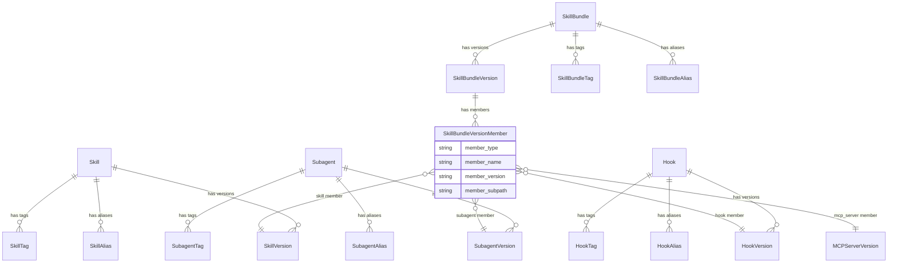

# RFC: Skill Registry

| Author(s)              | Bill Murdock (Red Hat) |
| :--------------------- | :-- |
| **Date Last Modified** | 2026-06-12 |
| **AI Assistant(s)**    | Claude Code (Opus 4.6) |

# Summary

Add a Skill Registry to MLflow: a governed, metadata-first registry for
AI agent capabilities. The registry stores metadata and typed source
pointers (to Git repos, OCI registries, ZIP archives, etc.). It can
also store content directly via MLflow artifact storage, but the
primary design is metadata-first. It provides enterprise governance
on top of existing distribution mechanisms: lifecycle management,
usage analytics via traces, and federated discovery across sources.

The registry manages four entity types under the `mlflow.genai.skills`
SDK namespace (CLI: `mlflow skills`), each with full lifecycle
(versioning, aliases, tags, status):

- **Skills**: a directory containing a SKILL.md entry point plus
  supporting files (scripts, templates, reference material)
- **Subagents**: sub-agent definitions that can be invoked by a
  parent agent
- **Hooks**: event-triggered actions (harness-specific)
- **Skill bundles**: versioned, governed units that group related
  capabilities and map to the "plugin" concept in agent harnesses.
  Bundles can also reference MCP servers from the MCP Server Registry
  (RFC-0004) via cross-registry membership.

`mlflow skills pull` provides a harness-agnostic way to fetch
registered content from its source. Harness-specific installation
(manifest generation, directory placement) is covered in a companion
RFC (RFC-0009).

# User journeys

These journeys illustrate the end-to-end workflows that the Skill
Registry enables. Each shows both CLI and UI paths.

## Register a skill bundle

1. Register individual capability versions pointing to their sources:
   ```bash
   mlflow skills register --name code-review --version 1.0.0 \
       --source https://github.com/acme/agent-skills.git@v1.0.0 \
       --subpath code-review
   mlflow subagents register --name security-auditor --version 1.0.0 \
       --source https://github.com/acme/agent-skills.git@v1.0.0 \
       --subpath security-auditor
   mlflow hooks register --name pre-commit-scan --version 1.0.0 \
       --source https://github.com/acme/agent-skills.git@v1.0.0 \
       --subpath pre-commit-scan
   ```
   **SDK equivalent:**
   ```python
   import mlflow

   mlflow.genai.skills.register_skill(
       name="code-review",
       version="1.0.0",
       description="Reviews pull requests for correctness, style, and security",
       source_type="git",
       source="https://github.com/acme/agent-skills.git@v1.0.0",
       subpath="code-review",
   )
   ```
   **UI path:** Navigate to the Skills page, click "Register Skill,"
   fill in name, version, source type, and source URL, then submit.
   Repeat for subagents and hooks using the type selector.
2. Create a skill bundle version that pins these members:
   ```bash
   mlflow skill-bundles create-version --name pr-workflow --version 1.0.0 \
       --skill code-review:1.0.0 \
       --subagent security-auditor:1.0.0 \
       --hook pre-commit-scan:1.0.0
   ```
   **UI path:** Navigate to the Bundles tab, click "Create Bundle,"
   add members by searching and selecting from registered capabilities.
3. Transition the bundle version from draft to active:
   ```bash
   mlflow skill-bundles update-version --name pr-workflow \
       --version 1.0.0 --status active
   ```
   **UI path:** Open the bundle version detail page, use the status
   dropdown to change from "draft" to "active."
4. Set an alias for stable downstream resolution:
   ```bash
   mlflow skill-bundles set-alias --name pr-workflow \
       --alias production --version 1.0.0
   ```
   **UI path:** In the bundle detail page, click "Add Alias" and map
   `production` to version `1.0.0`.

## Discover a skill for a specific purpose

1. Search the registry by keyword:
   ```bash
   mlflow skills search --filter "name LIKE '%review%'" --status active
   ```
   **UI path:** Navigate to the Skills page, type "review" in the
   search bar, and filter by status "active" using the dropdown.
2. Browse the returned list of matching skills with names,
   descriptions, and latest versions.
   **UI path:** Scan the card-based list view. Each card shows the
   skill name, description, latest version badge, status badge, and
   tags.
3. Get details on a promising result:
   ```bash
   mlflow skills get --name code-review
   ```
   **UI path:** Click a card to open the detail view with metadata,
   version history, aliases, tags, and bundle memberships.
4. Inspect a specific version's source and metadata:
   ```bash
   mlflow skills get-version --name code-review --version 1.0.0
   ```
5. Pull the skill locally to read the content and decide whether
   it fits:
   ```bash
   mlflow skills pull --name code-review --version 1.0.0 \
       --destination ./review-skill
   ```

## Install a skill bundle, run the agent, browse traces

1. Install the bundle for a harness
   ([RFC-0009](../0009-skill-harness-integration/0009-skill-harness-integration.md)):
   ```bash
   mlflow skills install-bundle --name pr-workflow --alias production \
       --harness claude-code --lock
   ```
   This pulls the bundle content, generates harness-specific
   manifests, writes a lock file, and writes a trace manifest
   (`mlflow-skills-manifest.json`) with installed registry
   coordinates. Harnesses with autologger support
   (e.g., Claude Code) can use this manifest to automatically
   create SKILL spans when a registered skill is invoked, with no
   manual `skill_context()` calls needed (see
   [Trace integration](#trace-integration)).
2. Run the agent. The harness loads the installed plugin and invokes
   skills during a conversation.
3. Open the MLflow UI and navigate to the Traces page. Click the
   "Skills" tab to filter for traces with SKILL spans.
4. Find the trace for the agent run. Skill invocations appear as
   SKILL spans in the trace tree, annotated with registry coordinates
   (skill name, version, registry).
5. Click a SKILL span to see which registered skill version was used
   and how long it took. Click the skill name link to navigate to the
   skill's registry detail page.

## Evaluate two bundle versions with LLM judges

MLflow's
[LLM judges](https://mlflow.org/docs/latest/genai/eval-monitor/scorers/)
can autonomously explore execution traces via MCP tools. Because
skill invocations produce traced SKILL spans, LLM judges can
analyze how skills were used during an agent run.

1. Register a new version of the bundle with updated members:
   ```bash
   mlflow skills register --name code-review --version 2.0.0 \
       --source https://github.com/acme/agent-skills.git@v2.0.0 \
       --subpath code-review
   mlflow skill-bundles create-version --name pr-workflow --version 2.0.0 \
       --skill code-review:2.0.0 \
       --subagent security-auditor:1.0.0 \
       --hook pre-commit-scan:1.0.0
   ```
2. Install v1.0.0 and run it on a set of test inputs. Traces are
   recorded in MLflow under experiment A.
3. Install v2.0.0 and run it on the same test inputs. Traces are
   recorded under experiment B.
4. Use `mlflow.genai.evaluate()` with a `make_judge` scorer that
   uses the `{{ trace }}` template variable to score both sets of
   traces against quality criteria (correctness, helpfulness, safety).
5. Compare the evaluation results side by side in the MLflow UI to
   determine whether v2.0.0 is an improvement.
6. If v2.0.0 is better, transition it to active and update the
   production alias:
   ```bash
   mlflow skill-bundles update-version --name pr-workflow \
       --version 2.0.0 --status active
   mlflow skill-bundles set-alias --name pr-workflow \
       --alias production --version 2.0.0
   ```

## Trace skill lineage to evaluation results

After running evaluations, a user wants to know which registered
skill version was active during a traced agent run. The lineage
path flows through traces: evaluation results link to traces, and
traces contain SKILL spans annotated with registry coordinates.

1. Run an agent with installed skills. Skill invocations produce
   SKILL spans in the recorded traces (see
   [Trace integration](#trace-integration)).
2. Run evaluation against the collected traces:
   ```python
   results = mlflow.genai.evaluate(
       data=traces_df,
       scorers=[correctness_scorer, helpfulness_scorer],
   )
   ```
   Each row in `results.result_df` includes a `trace_id` linking
   the evaluation result back to its source trace.
3. Find which skill versions were used in a specific evaluation
   result:
   ```python
   trace = mlflow.get_trace(trace_id)
   skill_spans = trace.search_spans(span_type="SKILL")
   for span in skill_spans:
       print(span.attributes["mlflow.skill.name"],
             span.attributes["mlflow.skill.version"])
   ```
4. Find all traces that used a specific skill version:
   ```python
   traces = mlflow.search_traces(
       experiment_ids=[experiment_id],
       filter_string=(
           'span.type = "SKILL"'
           ' AND span.attributes.mlflow.skill.name = "code-review"'
           ' AND span.attributes.mlflow.skill.version = "1.0.0"'
       ),
   )
   ```
   Evaluation results for these traces can then be retrieved via
   their `trace_id` values.

This two-step approach (query traces by skill attributes, then
retrieve associated evaluation results) works with the existing
MLflow tracing and evaluation APIs. Richer integration, such as
filtering evaluation results directly by skill version, is
follow-up work (see [Adoption strategy](#adoption-strategy)).

## CI pipeline for automated regression detection

1. A CI job (e.g., GitHub Actions) triggers on pushes to the skill
   source repo.
2. The job registers a new skill bundle version from the updated
   source:
   ```bash
   mlflow skills register --name code-review --version 1.1.0 \
       --source https://github.com/acme/agent-skills.git@v1.1.0 \
       --subpath code-review
   mlflow skill-bundles create-version --name pr-workflow --version 1.1.0 \
       --skill code-review:1.1.0 \
       --subagent security-auditor:1.0.0 \
       --hook pre-commit-scan:1.0.0
   ```
3. The job installs the new bundle version and runs it against a
   benchmark dataset, collecting traces in a dedicated MLflow
   experiment.
4. The job runs
   [LLM judge](https://mlflow.org/docs/latest/genai/eval-monitor/scorers/)
   evaluation on the collected traces, producing scored results.
5. The job fetches the benchmark results from the previous production
   version (stored as MLflow metrics or evaluation artifacts).
6. The job compares the new scores against the previous scores. If
   any quality metric regresses beyond a configured threshold, it
   sends an alert (Slack, email, or fails the CI check).
7. If no regression is detected, the job transitions the new version
   to active and optionally updates the production alias.

See [implementation-details.md: SDK and CLI code
examples](implementation-details.md#sdk-and-cli-code-examples) for
additional SDK examples including cross-registry bundles, OCI subpath
registration, and discovery/search operations.

## Motivation

### The problem

AI agent capabilities (skills, sub-agents, MCP server configurations,
and hooks) are becoming a critical asset class in enterprise AI
platforms. As organizations adopt agentic AI, they accumulate these
capabilities across teams, repositories, and agent harnesses.

A cross-harness portable format is emerging around these capabilities.
The registry is format-agnostic but is designed to interoperate with
the conventions gaining adoption across agent harnesses:

- **SKILL.md**: a markdown file with structured instructions for the
  agent. Supported by Claude Code, Codex CLI, Cursor, GitHub Copilot,
  OpenClaw, Kilo Code, and Antigravity. This is the most broadly
  portable format for skills and subagents.
- **MCP server configs**: JSON configuration for Model Context
  Protocol servers. MCP is a universal tool extension protocol
  supported by nearly all major harnesses.
- **Hooks**: event-triggered shell commands or scripts. Less
  standardized; Claude Code and Codex CLI have the most mature hook
  support.
- **Plugin bundles**: packaging of skills, subagents, MCP configs, and
  hooks into a single installable unit. Formats range from
  harness-specific (Claude Code and Codex CLI `plugin.json` manifests)
  to cross-harness (e.g., Lola's "AI Context Modules," which use
  directory auto-discovery to target multiple harnesses from a single
  package).

Today, these capabilities are managed as ad-hoc files in Git
repositories. This works well for individual developers and small
teams. GitHub provides versioning, collaboration, and access control.

However, enterprises face governance challenges that Git alone does not
address:

1. **No status lifecycle.** Git has no concept of "this version is
   approved for production use" vs. "this is deprecated." Teams resort
   to branch naming conventions or external tracking to manage
   promotion.

2. **Fragmented discovery.** Capabilities may live in multiple Git
   repos, OCI registries, or other distribution systems. There is no
   single discovery layer across all of these.

3. **No cross-type bundling.** Agent harnesses like Claude Code and
   Codex CLI support plugins that bundle skills, subagents, MCP
   servers, and hooks together. But there is no agent-neutral way to
   represent these bundles for governance and discovery.

4. **No trace-to-skill linkage.** MLflow already traces agent
   conversations (Claude Code via `mlflow autolog claude`, SDK
   applications via framework autologgers such as
   `mlflow.langchain.autolog()` and `mlflow.anthropic.autolog()`).
   These traces capture LLM calls, tool use, and token consumption,
   but there is no way to know which governed, versioned skill was
   active during any part of a trace. This RFC introduces
   `mlflow.skill_context()` for manual instrumentation and an
   install-time trace manifest for automatic instrumentation via
   harness autologgers (see [Trace integration](#trace-integration)).
   Without a registry, organizations cannot answer questions like
   "which skill versions are most used?" or "show me all traces where
   the deprecated code-review v1.0 was loaded."

5. **No pull mechanism.** Once a user discovers a capability in the
   registry, there is no standard way to fetch its content from the
   source system. Users must manually copy source pointers and run
   harness-specific install steps.

### Out of scope

- **Artifact storage as the only path.** The registry supports both
  external source pointers (Git, OCI, ZIP) and direct artifact storage
  (`source_type="mlflow"`). However, it is not an artifact-only store;
  the metadata-first, source-pointer model remains the primary design.
- **Authoring or development tools.** The registry manages published
  capabilities, not the process of writing them.
- **Format specification.** The registry is format-agnostic. It does
  not define what a skill must contain or how it must be structured.
  The SKILL.md convention is an ecosystem convention, not a registry
  requirement.
- **Agent routing or orchestration.** The registry is a metadata and
  governance layer. It does not decide which skills to invoke at
  runtime or how agents compose capabilities.
- **MCP server hosting.** MCP server deployment and runtime management
  are covered by the MCP Server Registry (RFC-0004) and the MCP
  Gateway.
- **Prompts.** MLflow already has a Prompt Registry for versioned
  prompt template management. Skills and prompts serve different
  purposes: a skill provides instructions and tools for agent
  autonomy, while a prompt provides templated text for structured
  generation. Skills may reference prompts, but they belong in
  separate registries because they have different lifecycles, different
  audience (harness-based agents vs. custom agentic code). The two
  registries are complementary but separate.

## Detailed design

### Entities and data model



`SkillBundleVersionMember` is the membership row for an entry in a
bundle version. The member target is determined by `member_type`; MCP
server references may be resolved against the MCP Registry rather than
enforced as local database foreign keys.

#### Skill

A skill is a directory containing a SKILL.md entry point plus
supporting files (scripts, templates, reference material). The
`Skill` entity is the logical governed asset, scoped to a workspace.
Key fields include `name` (unique within workspace), `display_name`,
`status` (read-only, derived from the parent-resolved version),
`latest_version` (read-only, highest active semver), and `aliases`.

**MCP servers.** MCP servers are registered in the MCP Server Registry
(RFC-0004), not in this registry. Skill bundles can reference MCP
registry entries in their `mcp_servers` list. MCP configs embedded in
bundle-level artifacts (e.g., `.mcp.json` inside an OCI image) are
treated as artifact content discovered by harness adapters during
installation (RFC-0009), not as separately registered entities.

#### SkillVersion

A versioned record containing a typed source pointer (`git`, `oci`,
`zip`, or `mlflow`), status, and tags. The `(name, version)` pair is
unique within a workspace. Source pointers and version strings are
immutable after creation; to point to different content, register a
new version. The optional `subpath` field identifies content within a
shared artifact (used with OCI and ZIP). The optional `content_digest`
field enables integrity verification.

#### Subagent and Hook

`Subagent` (a sub-agent definition invocable by a parent agent) and
`Hook` (an event-triggered action, e.g., a shell command before a
commit) follow the same structure as `Skill`: top-level governed
assets with the same fields, versions, tags, aliases, and lifecycle.
`SubagentVersion` and `HookVersion` follow the same structure as
`SkillVersion`.

All registry entity types share the same version, tag, alias, and
lifecycle patterns. The store interface, REST API, and SDK expose
parallel operations for each type.

#### SkillBundle

A skill bundle groups related capabilities (skills, subagents, hooks,
and MCP servers) into a governed unit that maps to the "plugin"
concept in agent harnesses. Follows the same top-level pattern as
Skill: versions, tags, aliases, and derived status.

**Why bundles instead of tags?** Tags could express "these skills
are related" but cannot provide versioned membership snapshots
(reproducible point-in-time combinations), cross-registry references
(MCP servers from RFC-0004), bundle-level source pointers (a single
OCI image), independent lifecycle (deprecate a bundle without
deprecating its members), or direct mapping to the harness plugin
concept.

#### SkillBundleVersion

A versioned snapshot of a bundle's membership. A bundle version is
one of two kinds:

- **Assembled:** captures member references for skills, subagents,
  hooks, and MCP servers. Skill, subagent, and hook
  versions have their own sources. `pull` fetches members individually.
- **Monolithic:** has its own source pointer (e.g., a single OCI
  image containing a complete plugin) and member references. Skill,
  subagent, and hook versions may omit their own sources when their
  content lives inside the bundle artifact. `pull` fetches the bundle
  artifact as a unit.

A bundle version cannot have both a bundle-level source and
skill/subagent/hook member versions with their own sources. This avoids
confusion about which source is authoritative for registry-managed
capability content.

Dataclass definitions, field tables, source type details, and
cross-registry reference handling for all entity types are in
[implementation-details.md](implementation-details.md#skill-entity).

#### Aliases and tags

All entity types use the same alias pattern: a frozen `(name, alias,
version)` tuple mapping a stable name (e.g., `production`) to a
specific version string. Tags are `(key, value)` pairs at both the
entity level and version level. Subagent, Hook, and SkillBundle
follow the same patterns.

### Status and lifecycle

This lifecycle aligns with the MCP Server Registry (RFC-0004).

#### Per-version status

Each `SkillVersion`, `SubagentVersion`, `HookVersion`, and
`SkillBundleVersion` has an independent status:

| State | Meaning | Downstream surfacing |
|---|---|---|
| `draft` | Registered but not yet ready for downstream use | Not surfaced to consumers |
| `active` | Ready for downstream use | Surfaced to discovery, traces, consumers |
| `deprecated` | Still functional but no longer recommended | Surfaced with deprecation signal |
| `deleted` | Soft-deleted; preserved internally for history, no longer active | Not surfaced by normal get/search/list APIs |

New versions default to `draft` upon creation.

Allowed transitions:

| From | To |
|---|---|
| `draft` | `active`, `deleted` |
| `active` | `draft`, `deprecated` |
| `deprecated` | `active`, `deleted` |

`draft` allows a version to be registered and reviewed before being
made visible to consumers. `active` can
return to `draft` (unpublish) for cases where a version needs to be
pulled back for further review. `deprecated` can return to `active`
(re-activate) for cases where a deprecation was premature. `deleted`
is terminal.

Normal version delete operations (`delete_skill_version`,
`delete_subagent_version`, `delete_hook_version`, and
`delete_skill_bundle_version`) transition the version to `deleted`
rather than physically removing the version row, subject to the allowed
lifecycle transitions above. Active versions must first be unpublished
or deprecated before they can be deleted. As in the Model Registry,
normal get/search/latest resolution excludes deleted versions, while
internal audit/provenance paths may still retain enough metadata to
explain historical traces and bundle snapshots. Deleting a version also
removes aliases that point to that version.

Top-level entity delete operations (`delete_skill`, `delete_subagent`,
`delete_hook`, and `delete_skill_bundle`) are administrative hard
deletes that remove the parent and cascade to child rows, following the
Model Registry registered-model pattern. These operations are subject
to referential-integrity checks: for example, a skill version referenced
by a bundle version cannot be physically removed until the referencing
bundle version is removed or otherwise no longer references it. Normal
retirement should use version deprecation or version soft delete rather
than top-level hard delete.

#### Entity-level status

`Skill.status`, `Subagent.status`, `Hook.status`, and
`SkillBundle.status` are read-only. They are derived from the
parent-resolved version: the highest semantic version among `active`
versions if one exists, otherwise the highest semantic version among
non-`deleted` non-`active` versions. Deleted versions never drive
parent status. This follows the MCP Server Registry pattern
(RFC-0004).

#### `latest_version` resolution

Version strings must follow [semantic versioning](https://semver.org/)
(e.g., `1.0.0`, `2.1.0-beta.1`). `get_latest_skill_version(name)`
returns the highest semantic version among `active` versions if one
exists, otherwise the highest semantic version among non-`deleted`
non-`active` versions. Prerelease identifiers participate in
semantic-version ordering, while build metadata does not.
`latest_version` is a read-only computed field on the parent entity
(not manually pinnable); aliases cover the use case of pointing a
stable name (e.g., `production`) at a specific version. This follows
the same resolution rule as the MCP Server Registry (RFC-0004).

The alias name `latest` is reserved: `set_skill_alias(...,
alias="latest", ...)` is rejected, while
`get_skill_version_by_alias(..., alias="latest")` is treated as a
convenience alias for `get_latest_skill_version(...)`.

The same pattern applies to `Subagent`, `Hook`, `SkillBundle`, and
their corresponding `get_latest_*_version` methods. This aligns with
the MCP Server Registry (RFC-0004).

### Implementation details

Database schema (table definitions), store interface (method
signatures), SDK convenience functions, REST API endpoints,
pagination/filtering, and Python SDK/CLI mapping are in
[implementation-details.md](implementation-details.md).

### Pull semantics

`pull` is a client-side operation. The SDK reads the source pointer
from the registry via the REST API, then fetches content directly
from the source system to the caller's local filesystem. The registry
server is not involved in content transfer. `pull` is
source-type-aware:

| Source type | Pull behavior |
|---|---|
| `git` | `git clone` or `git archive` of the referenced path/ref |
| `oci` | `oci pull` of the referenced image/tag; if `subpath` is set, extract only that path from the image |
| `zip` | HTTP download and extract; if `subpath` is set, extract only that path from the archive |
| `mlflow` | Download the version's MLflow-managed artifact directory tree using the same artifact APIs and credentials as other MLflow artifact operations |

**Single skill pull.** Fetches the content at the skill version's
`source` to the destination directory. If `subpath` is set, only the
content at that path within the artifact is extracted. Returns an
error if the skill version has no `source`; source-less embedded skill
versions are pullable only through their containing monolithic bundle.

**Skill bundle pull.** For monolithic bundles, fetch the bundle
artifact as a single unit to the destination directory. For assembled
bundles, pull each member individually from its own `source` to a
subdirectory of the destination, named by the member's name. If a
skill, subagent, or hook member in an assembled bundle has no `source`,
the pull fails rather than producing a partial local bundle.

If `content_digest` is set, `pull` verifies the fetched content
matches the digest and returns an error on mismatch. This
verification is client-side. The server stores the digest as metadata
but does not re-verify artifact store contents on each request.

`pull` is harness-agnostic. It downloads content but does not generate
harness-specific manifests or place files in harness-specific
directories. Harness-specific installation is covered in RFC-0009.

See [implementation-details.md: Pull semantics
details](implementation-details.md#pull-semantics-details) for source
authentication mechanisms per source type, source availability error
handling, and credential management.

### Workspace scoping

All skill registry operations are workspace-scoped, following MLflow's
existing workspace-aware registry patterns (model registry, MCP
registry). Cross-workspace sharing is out of scope for this RFC and
should be solved at the platform level across all MLflow registries.

### Permissions

The skill registry integrates with MLflow's existing permission
framework (READ / EDIT / MANAGE), applied at the `Skill`, `Subagent`,
`Hook`, and `SkillBundle` level. Versions, tags, aliases, and
memberships inherit permissions from their parent entity.

| Permission | Operations |
|---|---|
| `READ` | Search entities, get versions, resolve aliases, list tags and memberships |
| `EDIT` | Create entities, create versions, set tags, update description, status transitions (activate, deprecate), set aliases |
| `MANAGE` | Delete aliases, delete tags, soft-delete versions, hard-delete entities, manage permissions |

This follows the same pattern as the model registry and MCP Server
Registry (RFC-0004): status transitions and alias setting are gated
by `EDIT` (`can_update`), while destructive operations (deletes) are
gated by `MANAGE` (`can_delete`).
- **Creator gets MANAGE.** When a user creates an entity (skill,
  subagent, hook, or bundle), they automatically receive MANAGE
  permission, following the MLflow model registry pattern.

### UI

The Skills page lives under the GenAI workflow in the MLflow sidebar,
alongside Experiments, Prompts, MCP Servers, and AI Gateway.

#### List view

The list view shows skills, subagents, hooks, and bundles together
using a card-based layout consistent with the MCP Server Registry
(RFC-0004). Each card displays:

- Entity type badge (skill, subagent, hook, or bundle)
- Name and optional display name
- Description (truncated to 2-3 lines)
- Latest version badge (e.g., "v1.0.0")
- Status badge with color coding: draft (gray), active (green),
  deprecated (amber)
- Source type indicator (Git, OCI, ZIP, MLflow)
- Tag chips

The filter bar provides:

- **Type dropdown**: skill, subagent, hook, bundle (multi-select)
- **Status dropdown**: draft, active, deprecated
- **Source type dropdown**: git, oci, zip, mlflow
- **Search**: by name or description

A "Register Skill" button (with a dropdown for subagent, hook, or
bundle) initiates registration.

#### Detail view: skills, subagents, hooks

The detail view for an individual capability shows:

- **Metadata section**: name, display name, description, status,
  workspace, source type, created by, created at, last updated
- **Version table**: Version, Registered at, Status, Source type,
  Created by, Description. Clicking a version row navigates to the
  version detail page showing source, subpath, content digest, and
  tags.
- **Aliases**: alias name to version mapping (e.g.,
  `production -> 1.0.0`)
- **Tags**: key-value list with edit controls
- **Bundle memberships**: list of bundles that include this capability,
  with links to each bundle's detail page
- **Related traces**: link to the GenAI Traces page filtered by this
  skill's name, showing recent SKILL spans that reference this
  capability

#### Detail view: bundles

The bundle detail view shows:

- **Metadata section** (as above)
- **Members table** for the selected bundle version, grouped by type:
  Type (skill/subagent/hook/mcp_server), Name, Pinned version, Source
  type, Status. Each row links to the member's detail page.
  Cross-registry members (MCP servers) link to the MCP Server Registry
  detail page.
- **Version history table**: Version, Registered at, Status, Created
  by, Member count
- **Aliases and tags** (as above)

#### Trace integration display

The GenAI Traces page includes a "Skills" tab alongside the existing
"Prompts" tab, showing SKILL spans for each trace. The trace detail
view displays SKILL spans with registry coordinates (skill name,
version, workspace) and links to the skill's registry detail page.
Skill version detail pages surface related traces using the same
association data.

### Trace integration

MLflow already traces agent conversations across multiple frameworks:
Claude Code (via `mlflow autolog claude`), SDK applications (via
framework autologgers such as `mlflow.langchain.autolog()` and
`mlflow.anthropic.autolog()`), and others. These
traces capture LLM calls, tool use, and timing as a tree of spans.
The skill registry closes the observability loop by letting agent
developers indicate which registered skill is active during each
part of a trace.

#### `mlflow.skill_context()` context manager

The primary instrumentation API is a context manager that creates a
span of type `SKILL` and attaches registry coordinates as span
attributes:

```python
with mlflow.skill_context(
    name="code-review", version="1.0.0"
) as span:
    # All spans created inside this block (including those from
    # autologgers) become children of this SKILL span.
    result = llm.chat([{"role": "user", "content": "Review this code..."}])
```

The context manager creates a span with `mlflow.skill.name`,
`mlflow.skill.version`, and `mlflow.skill.workspace`
attributes that link the span back to a specific skill version in
the registry. See [implementation-details.md: skill_context() span
attributes](implementation-details.md#skill_context-span-attributes)
for the full attribute table.

#### Scope of skill_context()

`skill_context()` is for skills only, and it is not applicable to
subagents, hooks, or bundles.
  Bundle-level analytics are derived by aggregating over traces of
  individual member skills.

#### Workspace resolution

When `skill_context()` is called, the workspace is resolved from
the `mlflow-skills-manifest.json` written by the install commands
(`mlflow skills install` / `install-bundle`)
(defined in
[RFC-0009](../0009-skill-harness-integration/0009-skill-harness-integration.md)).
The manifest always contains the workspace for each installed skill or
other bundle entry.
For SDK users calling `skill_context()` directly without a manifest,
the workspace defaults to the current MLflow tracking URI's workspace
context, consistent with other MLflow operations.

#### Skill stacks via nesting

Skills can invoke other skills. Nesting `skill_context()` calls
produces a skill stack in the trace tree:

```
+-- Span: "code-review" (type: SKILL, version: 1.0.0)
|   +-- Span: ChatCompletion (type: LLM)
|   +-- Span: "style-check" (type: SKILL, version: 2.0.0)
|   |   +-- Span: ChatCompletion (type: LLM)
|   +-- Span: ChatCompletion (type: LLM)
```

Walking up the ancestor chain and collecting SKILL spans reconstructs
the skill stack for any span.

#### What this enables

Skill-annotated traces enable adoption tracking (which versions are
most used), deprecation impact analysis (which traces used a
deprecated version), per-skill cost attribution (aggregate token
usage and latency per SKILL span), and regression detection (compare
trace outcomes across skill versions).

#### Autologger compatibility

Because `skill_context()` creates a standard MLflow span, it works
with existing autologgers without modification. When an autologger
(Claude, LangChain, OpenAI, etc.) creates a span inside a
`skill_context()` block, that span automatically becomes a child of
the SKILL span. No changes to the autologgers are needed.

For harness-specific integration (e.g., Claude Code automatically
wrapping skill loads in `skill_context()` spans), see RFC-0009.

#### Registry validation

`skill_context()` does not validate that the named skill exists in
the registry at call time. Validating on every invocation would add
latency and create a hard dependency on registry availability. The
trace records the `{workspace, name, version}` coordinates
regardless; the MLflow UI performs a best-effort lookup when
displaying traces and shows a "not found in registry" indicator if
the coordinates do not resolve.

#### Relationship to MCP trace linking

The MCP Registry (RFC-0004) uses after-the-fact, trace-level
association (`link_mcp_server_versions_to_trace()`). Skills use
span-level, inline annotation because skills are ambient (active
during inference) and can nest. Both approaches produce trace
metadata that the MLflow UI can display together.

## Drawbacks

- **Source pointer validity.** For external sources (git, oci, zip),
  the registry cannot guarantee pointers remain valid. The optional
  `content_digest` field mitigates content tampering but does not
  prevent link rot. Users who need self-contained storage can use
  `source_type="mlflow"` to store content directly in MLflow artifact
  storage.

# Alternatives

## Store skill artifacts only in MLflow (no source pointers)

Make MLflow artifact storage the sole storage mechanism, with no
support for external source pointers.

Rejected because most organizations already manage skills in Git or
OCI. Source pointers federate across existing distribution mechanisms
without requiring migration. The current design supports both:
`source_type="mlflow"` for direct artifact storage alongside
`source_type="git"`, `"oci"`, and `"zip"` for external sources.

## Use Git alone (no registry)

Continue using Git repositories as the sole mechanism for skill
management.

This is sufficient for individual developers and small teams. This RFC
proposes a governance layer on top of Git for enterprises that need
status lifecycle and federated discovery.
The two approaches are complementary.

# Adoption strategy

New feature, not a breaking change. Phased rollout:

- **Phase 1 (this RFC):** Registry entities (Skill, Subagent, Hook, SkillBundle), store, REST API, SDK, CLI, UI, `mlflow skills pull`, and `mlflow.skill_context()` for trace integration.
- **Phase 2 (RFC-0009):** Harness-specific `mlflow skills install` / `install-bundle` for Claude Code, Codex CLI, and Cursor. Automatic `skill_context()` wrapping in harness-specific autologgers.
- **Phase 3 (follow-up):** Usage analytics dashboards, install count tracking, cross-workspace export/import (following cross-registry patterns), shared base extraction with the MCP registry, and richer evaluation-to-skill query integration (e.g., filtering evaluation results directly by skill version attributes).
